# WarisanMakan — Complete Database Structure

**Project:** Culinary Heritage Tourism System (WarisanMakan)  
**Technology:** Laravel, PHP, Blade, MySQL  
**Architecture:** Modular Monolith using Laravel MVC with a Service Layer  
**Document purpose:** Define one organised relational database shared by all six system modules.

---

## 1. Source Basis and Confirmed Decisions

This database design is based on the WarisanMakan proposal, requirement analysis, overall module scope, and the design decisions confirmed by the team.

### 1.1 Confirmed decisions

| No. | Decision | Selected design |
|---|---|---|
| 1 | Authentication | Google authentication only |
| 2 | Heritage food stories | Store in a separate `heritage_food_stories` table; may be changed later |
| 3 | Shop categories | One shop may belong to multiple food categories |
| 4 | Duplicate check-in | Allow another check-in after a configurable cooldown period; may be changed later |
| 5 | Generated food trails | Store only when the user saves, shares, starts, or favourites the trail |
| 6 | Blind Box source | Use a separately managed Blind Box recommendation pool |
| 7 | Trail completion | Support both verified check-in completion and manual completion |
| 8 | Media | Use one shared polymorphic `media` table for all modules |

### 1.2 Important flexibility choices

Because the food-story structure and check-in rule may change later:

- status and policy fields should preferably use `VARCHAR` values controlled by Laravel backed enums instead of hard-coded MySQL `ENUM` definitions;
- check-in behaviour should be controlled through `system_settings`, not hard-coded in controllers;
- heritage food stories remain separate from food items, but they are linked through foreign keys so the structure can be revised later;
- generated trails that the user does not save, share, favourite, or start should remain temporary in the session/cache and should not create permanent database rows.

---

# 2. Database Design Principles

1. **One database, separated by module ownership.** All modules use the same MySQL database, but each table has one clear owning module.
2. **Heritage shops are the central content source.** Passport, Trail, Contribution, and Blind Box records reference the official `heritage_shops` table.
3. **Do not duplicate complete shop or user information.** Store foreign keys and only keep snapshots where historical evidence is required.
4. **Use soft deletion for historically referenced records.** Shops, contributions, trails, pool records, and media should normally use `deleted_at`.
5. **Use database transactions for multi-table operations.** Examples include check-in plus passport update, contribution approval plus official record creation, and correction approval plus shop update.
6. **Use UTC timestamps in the database.** Convert them to Malaysia time in the application interface.
7. **Use `BIGINT UNSIGNED` primary keys.** This matches Laravel's default `id()` and `foreignId()` migration methods.
8. **Store files outside MySQL.** The database stores file paths and metadata; the actual images/videos remain in Laravel storage or cloud storage.

---

# 3. Module and Table Summary

| Module | Main tables |
|---|---|
| Shared/Foundation | `states`, `system_settings`, `media`, `notifications`, `audit_logs` |
| User Management | `users` |
| Heritage Shop Tracking | `heritage_shops`, `food_categories`, `shop_categories`, `shop_operating_hours`, `heritage_food_items`, `heritage_food_stories` |
| Food Passport & Achievement | `user_passports`, `check_ins`, `achievement_badges`, `user_badges` |
| Food Trail & Navigation | `food_trails`, `trail_categories`, `food_trail_stops`, `favourite_trails`, `trail_progress`, `trail_stop_progress` |
| Community Contribution | `contributions`, `contribution_shop_details`, `contribution_shop_categories`, `contribution_food_story_details`, `contribution_versions`, `contribution_reviews`, `correction_requests`, `correction_reviews` |
| Blind Box Recommendation | `blind_box_pool`, `blind_box_sessions`, `blind_box_session_categories`, `blind_box_recommendations`, `blind_box_favourites` |

**Total recommended domain tables: 35**

Laravel may also create framework tables such as `sessions`, `cache`, `jobs`, `job_batches`, and `failed_jobs`. These are infrastructure tables and are not part of the business ERD.

---

# 4. Shared and Foundation Tables

## 4.1 `states`

Stores consistent Malaysian state and federal-territory values for filtering and route generation.

| Column | Type | Key / Rule | Description |
|---|---|---|---|
| `id` | BIGINT UNSIGNED | PK | State identifier |
| `name` | VARCHAR(100) | UNIQUE, NOT NULL | State name |
| `code` | VARCHAR(10) | UNIQUE, NOT NULL | Short code, such as `PNG` or `JHR` |
| `is_active` | BOOLEAN | DEFAULT TRUE | Controls whether it can be selected |
| `created_at` | TIMESTAMP | NOT NULL | Creation time |
| `updated_at` | TIMESTAMP | NOT NULL | Last update time |

### Seed data

Seed all Malaysian states and federal territories so users do not enter inconsistent spellings.

---

## 4.2 `system_settings`

Stores changeable system rules without requiring a new migration.

| Column | Type | Key / Rule | Description |
|---|---|---|---|
| `id` | BIGINT UNSIGNED | PK | Setting identifier |
| `module` | VARCHAR(50) | INDEX, NOT NULL | Owning module, for example `passport` or `blind_box` |
| `setting_key` | VARCHAR(100) | UNIQUE with `module` | Setting name |
| `value_json` | JSON | NOT NULL | Setting value |
| `description` | VARCHAR(255) | NULL | Administrator/developer explanation |
| `updated_by_user_id` | BIGINT UNSIGNED | FK → `users.id`, NULL | Last administrator who changed it |
| `created_at` | TIMESTAMP | NOT NULL | Creation time |
| `updated_at` | TIMESTAMP | NOT NULL | Last update time |

### Recommended initial settings

```json
{
  "passport.duplicate_policy": "COOLDOWN",
  "passport.cooldown_hours": 24,
  "passport.default_checkin_radius_m": 100,
  "passport.leaderboard_metric": "TOTAL_POINTS",
  "blind_box.prevent_consecutive_duplicate": true,
  "blind_box.maximum_rerolls": 5,
  "blind_box.default_max_distance_km": 20
}
```

The application should read and cache these values through a service instead of querying this table repeatedly.

---

## 4.3 `media`

One shared polymorphic table for shop images, food images, stories, contribution evidence, correction evidence, trail photos, and badge icons.

| Column | Type | Key / Rule | Description |
|---|---|---|---|
| `id` | BIGINT UNSIGNED | PK | Media identifier |
| `uploaded_by_user_id` | BIGINT UNSIGNED | FK → `users.id` | Uploader |
| `attachable_type` | VARCHAR(80) | INDEX, NOT NULL | Parent model type, such as `heritage_shop` |
| `attachable_id` | BIGINT UNSIGNED | INDEX, NOT NULL | Parent record identifier |
| `media_type` | VARCHAR(20) | NOT NULL | `IMAGE` or `VIDEO` |
| `disk` | VARCHAR(50) | DEFAULT `public` | Laravel filesystem disk |
| `file_path` | VARCHAR(500) | NOT NULL | Stored file path |
| `original_name` | VARCHAR(255) | NULL | Original uploaded filename |
| `mime_type` | VARCHAR(100) | NOT NULL | Verified MIME type |
| `file_size_bytes` | BIGINT UNSIGNED | NOT NULL | File size |
| `caption` | VARCHAR(255) | NULL | Optional caption |
| `display_order` | INT UNSIGNED | DEFAULT 0 | Gallery ordering |
| `is_primary` | BOOLEAN | DEFAULT FALSE | Main image flag |
| `created_at` | TIMESTAMP | NOT NULL | Upload time |
| `updated_at` | TIMESTAMP | NOT NULL | Last update time |
| `deleted_at` | TIMESTAMP | NULL | Soft deletion |

### Allowed `attachable_type` values

- `heritage_shop`
- `heritage_food_item`
- `heritage_food_story`
- `achievement_badge`
- `food_trail`
- `contribution`
- `correction_request`

### Important implementation note

A polymorphic table cannot enforce a normal foreign key from `attachable_id` to several different parent tables. Laravel policies, model events, and the shared Media Service must therefore validate ownership and remove orphan files safely.

---

## 4.4 `notifications`

Stores user notifications generated by Passport, Contribution, Correction, and other modules.

| Column | Type | Key / Rule | Description |
|---|---|---|---|
| `id` | BIGINT UNSIGNED | PK | Notification identifier |
| `user_id` | BIGINT UNSIGNED | FK → `users.id`, INDEX | Recipient |
| `notification_type` | VARCHAR(80) | INDEX, NOT NULL | Event type |
| `title` | VARCHAR(200) | NOT NULL | Notification title |
| `message` | TEXT | NOT NULL | Notification content |
| `reference_type` | VARCHAR(80) | NULL, INDEX | Related model type |
| `reference_id` | BIGINT UNSIGNED | NULL, INDEX | Related record ID |
| `action_url` | VARCHAR(500) | NULL | Page opened by the notification |
| `read_at` | TIMESTAMP | NULL, INDEX | Null means unread |
| `created_at` | TIMESTAMP | NOT NULL | Creation time |
| `updated_at` | TIMESTAMP | NOT NULL | Last update time |

---

## 4.5 `audit_logs`

Shared immutable audit history for important administrator actions.

| Column | Type | Key / Rule | Description |
|---|---|---|---|
| `id` | BIGINT UNSIGNED | PK | Audit identifier |
| `actor_user_id` | BIGINT UNSIGNED | FK → `users.id`, NULL | User/admin performing the action |
| `module` | VARCHAR(50) | INDEX, NOT NULL | Owning module |
| `auditable_type` | VARCHAR(80) | INDEX, NOT NULL | Record type |
| `auditable_id` | BIGINT UNSIGNED | INDEX, NOT NULL | Record identifier |
| `action` | VARCHAR(80) | INDEX, NOT NULL | Example: `PUBLISH_SHOP` |
| `old_values` | JSON | NULL | Values before change |
| `new_values` | JSON | NULL | Values after change |
| `reason` | TEXT | NULL | Optional reason/comment |
| `ip_address` | VARCHAR(45) | NULL | IPv4/IPv6 |
| `created_at` | TIMESTAMP | NOT NULL | Action time |

Normal application functions must not update or delete audit rows.

---

# 5. User Management Module

## 5.1 `users`

Google authentication is the only login method. No local password column is required.

| Column | Type | Key / Rule | Description |
|---|---|---|---|
| `id` | BIGINT UNSIGNED | PK | User identifier |
| `google_id` | VARCHAR(255) | UNIQUE, NOT NULL | Google account identifier |
| `email` | VARCHAR(255) | UNIQUE, NOT NULL | Google email |
| `email_verified_at` | TIMESTAMP | NULL | Verification time |
| `full_name` | VARCHAR(150) | NOT NULL | Display name |
| `avatar_url` | VARCHAR(500) | NULL | Google/profile image |
| `phone_number` | VARCHAR(30) | NULL | Optional profile field |
| `preferred_language` | VARCHAR(10) | NULL | Optional future translation preference |
| `role` | VARCHAR(30) | DEFAULT `USER`, INDEX | `USER` or `ADMIN` |
| `account_status` | VARCHAR(30) | DEFAULT `ACTIVE`, INDEX | `ACTIVE` or `DEACTIVATED` |
| `deactivated_at` | TIMESTAMP | NULL | Deactivation time |
| `deactivated_by_user_id` | BIGINT UNSIGNED | FK → `users.id`, NULL | Administrator who deactivated the account |
| `last_login_at` | TIMESTAMP | NULL | Last successful login |
| `remember_token` | VARCHAR(100) | NULL | Laravel remember token if used |
| `created_at` | TIMESTAMP | NOT NULL | Registration time |
| `updated_at` | TIMESTAMP | NOT NULL | Last profile update |

### Business rules

- One Google account creates only one WarisanMakan account.
- Deactivation does not delete check-ins, badges, trails, contributions, or history.
- Protected middleware must reject users whose `account_status` is not `ACTIVE`.
- Administrative status changes should also create an `audit_logs` record.

---

# 6. Heritage Shop Tracking Module

## 6.1 `heritage_shops`

The official and verified heritage-shop record used by all other modules.

| Column | Type | Key / Rule | Description |
|---|---|---|---|
| `id` | BIGINT UNSIGNED | PK | Shop identifier |
| `created_by_user_id` | BIGINT UNSIGNED | FK → `users.id` | Creator/admin |
| `published_by_user_id` | BIGINT UNSIGNED | FK → `users.id`, NULL | Publishing admin |
| `source_contribution_id` | BIGINT UNSIGNED | FK → `contributions.id`, NULL | Approved source contribution, if applicable |
| `shop_name` | VARCHAR(200) | INDEX, NOT NULL | Shop name |
| `slug` | VARCHAR(220) | UNIQUE, NOT NULL | Public URL slug |
| `short_description` | TEXT | NULL | Summary shown in listings |
| `establishment_year` | SMALLINT UNSIGNED | NULL | Establishment year |
| `founder_name` | VARCHAR(150) | NULL | Founder |
| `founder_background` | TEXT | NULL | Founder background |
| `current_owner_name` | VARCHAR(150) | NULL | Current-generation owner |
| `current_owner_details` | TEXT | NULL | Owner details |
| `family_heritage_story` | LONGTEXT | NULL | Family/shop history |
| `contact_number` | VARCHAR(30) | NULL | Contact number |
| `address_line` | VARCHAR(255) | NOT NULL | Street address |
| `city` | VARCHAR(100) | NOT NULL | City/town |
| `state_id` | BIGINT UNSIGNED | FK → `states.id`, INDEX | State |
| `postal_code` | VARCHAR(20) | NULL | Postal code |
| `latitude` | DECIMAL(10,7) | NULL | GPS latitude |
| `longitude` | DECIMAL(10,7) | NULL | GPS longitude |
| `halal_status` | VARCHAR(40) | DEFAULT `UNKNOWN`, INDEX | Halal classification |
| `is_passport_participant` | BOOLEAN | DEFAULT TRUE, INDEX | Eligible for check-in/passport |
| `checkin_radius_m` | INT UNSIGNED | NULL | Shop-specific radius; null uses system default |
| `publish_status` | VARCHAR(30) | DEFAULT `DRAFT`, INDEX | `DRAFT`, `PUBLISHED`, `UNPUBLISHED`, `ARCHIVED` |
| `published_at` | TIMESTAMP | NULL | Publication time |
| `created_at` | TIMESTAMP | NOT NULL | Creation time |
| `updated_at` | TIMESTAMP | NOT NULL | Last update |
| `deleted_at` | TIMESTAMP | NULL | Soft deletion |

### Suggested `halal_status` values

- `HALAL_CERTIFIED`
- `MUSLIM_FRIENDLY`
- `NON_HALAL`
- `UNKNOWN`

### Important constraints

- Index `(publish_status, state_id)` for shop listing filters.
- Index shop name for search; optionally add a MySQL FULLTEXT index on `shop_name`, `short_description`, and `family_heritage_story`.
- The application should detect likely duplicates using shop name plus address before insert.

---

## 6.2 `food_categories`

| Column | Type | Key / Rule | Description |
|---|---|---|---|
| `id` | BIGINT UNSIGNED | PK | Category identifier |
| `name` | VARCHAR(100) | UNIQUE, NOT NULL | Category name |
| `slug` | VARCHAR(120) | UNIQUE, NOT NULL | URL/filter value |
| `description` | TEXT | NULL | Category explanation |
| `is_active` | BOOLEAN | DEFAULT TRUE | Selection availability |
| `created_at` | TIMESTAMP | NOT NULL | Creation time |
| `updated_at` | TIMESTAMP | NOT NULL | Last update |

---

## 6.3 `shop_categories`

Many-to-many relationship because one shop may belong to several categories.

| Column | Type | Key / Rule | Description |
|---|---|---|---|
| `shop_id` | BIGINT UNSIGNED | PK/FK → `heritage_shops.id` | Shop |
| `category_id` | BIGINT UNSIGNED | PK/FK → `food_categories.id` | Category |
| `created_at` | TIMESTAMP | NOT NULL | Assignment time |

**Composite primary key:** (`shop_id`, `category_id`)

---

## 6.4 `shop_operating_hours`

| Column | Type | Key / Rule | Description |
|---|---|---|---|
| `id` | BIGINT UNSIGNED | PK | Operating-hour record |
| `shop_id` | BIGINT UNSIGNED | FK → `heritage_shops.id`, INDEX | Shop |
| `day_of_week` | TINYINT UNSIGNED | NOT NULL | 1 = Monday through 7 = Sunday |
| `opening_time` | TIME | NULL | Opening time |
| `closing_time` | TIME | NULL | Closing time |
| `is_closed` | BOOLEAN | DEFAULT FALSE | Closed all day |
| `notes` | VARCHAR(255) | NULL | Holiday/special notes |
| `created_at` | TIMESTAMP | NOT NULL | Creation time |
| `updated_at` | TIMESTAMP | NOT NULL | Last update |

**Unique constraint:** (`shop_id`, `day_of_week`)

---

## 6.5 `heritage_food_items`

| Column | Type | Key / Rule | Description |
|---|---|---|---|
| `id` | BIGINT UNSIGNED | PK | Food-item identifier |
| `shop_id` | BIGINT UNSIGNED | FK → `heritage_shops.id`, INDEX | Owning shop |
| `category_id` | BIGINT UNSIGNED | FK → `food_categories.id`, NULL | Main category |
| `created_by_user_id` | BIGINT UNSIGNED | FK → `users.id` | Creator/admin |
| `item_name` | VARCHAR(150) | NOT NULL | Food name |
| `description` | TEXT | NOT NULL | Food description |
| `heritage_significance` | TEXT | NULL | Cultural/heritage significance |
| `ingredients_notes` | TEXT | NULL | Optional ingredients notes |
| `price` | DECIMAL(10,2) | NULL | Optional because price is not consistently required |
| `availability_status` | VARCHAR(30) | DEFAULT `AVAILABLE`, INDEX | `AVAILABLE`, `UNAVAILABLE`, `ARCHIVED` |
| `created_at` | TIMESTAMP | NOT NULL | Creation time |
| `updated_at` | TIMESTAMP | NOT NULL | Last update |
| `deleted_at` | TIMESTAMP | NULL | Soft deletion |

**Recommended unique constraint:** (`shop_id`, `item_name`) where practical.

---

## 6.6 `heritage_food_stories`

Separate published story records, as currently confirmed.

| Column | Type | Key / Rule | Description |
|---|---|---|---|
| `id` | BIGINT UNSIGNED | PK | Story identifier |
| `shop_id` | BIGINT UNSIGNED | FK → `heritage_shops.id`, INDEX | Related shop |
| `food_item_id` | BIGINT UNSIGNED | FK → `heritage_food_items.id`, NULL | Related food item |
| `source_contribution_id` | BIGINT UNSIGNED | FK → `contributions.id`, NULL | Approved source |
| `created_by_user_id` | BIGINT UNSIGNED | FK → `users.id` | Creator/admin |
| `story_title` | VARCHAR(200) | NOT NULL | Story title |
| `story_content` | LONGTEXT | NOT NULL | Full heritage story |
| `cultural_significance` | TEXT | NULL | Cultural meaning |
| `publish_status` | VARCHAR(30) | DEFAULT `UNPUBLISHED`, INDEX | `PUBLISHED`, `UNPUBLISHED`, `ARCHIVED` |
| `published_at` | TIMESTAMP | NULL | Publication time |
| `created_at` | TIMESTAMP | NOT NULL | Creation time |
| `updated_at` | TIMESTAMP | NOT NULL | Last update |
| `deleted_at` | TIMESTAMP | NULL | Soft deletion |

### Future-change note

If the team later decides that a food story should be part of the food-item record, the application can migrate the story content into `heritage_food_items`. Keeping `food_item_id` and `source_contribution_id` makes that migration easier.

---

# 7. Food Passport & Achievement Module

## 7.1 `user_passports`

One summary record per user. Detailed history remains in `check_ins`.

| Column | Type | Key / Rule | Description |
|---|---|---|---|
| `id` | BIGINT UNSIGNED | PK | Passport identifier |
| `user_id` | BIGINT UNSIGNED | UNIQUE, FK → `users.id` | Passport owner |
| `total_checkins` | INT UNSIGNED | DEFAULT 0 | All accepted check-ins |
| `unique_shops_visited` | INT UNSIGNED | DEFAULT 0 | Unique shops visited |
| `total_points` | INT UNSIGNED | DEFAULT 0, INDEX | Leaderboard points |
| `completion_percentage` | DECIMAL(5,2) | DEFAULT 0 | Participating-shop completion |
| `last_checkin_at` | TIMESTAMP | NULL | Most recent visit |
| `created_at` | TIMESTAMP | NOT NULL | Creation time |
| `updated_at` | TIMESTAMP | NOT NULL | Last recalculation |

The summary must be updated in the same transaction as a successful check-in.

---

## 7.2 `check_ins`

| Column | Type | Key / Rule | Description |
|---|---|---|---|
| `id` | BIGINT UNSIGNED | PK | Check-in identifier |
| `user_id` | BIGINT UNSIGNED | FK → `users.id`, INDEX | Visitor |
| `shop_id` | BIGINT UNSIGNED | FK → `heritage_shops.id`, INDEX | Visited shop |
| `checked_in_at` | TIMESTAMP | INDEX, NOT NULL | Accepted check-in time |
| `user_latitude` | DECIMAL(10,7) | NOT NULL | Captured user latitude |
| `user_longitude` | DECIMAL(10,7) | NOT NULL | Captured user longitude |
| `distance_from_shop_m` | DECIMAL(10,2) | NOT NULL | Verified distance |
| `passport_stamp_code` | VARCHAR(100) | UNIQUE, NOT NULL | Digital stamp code |
| `points_awarded` | INT UNSIGNED | DEFAULT 0 | Points from this visit |
| `created_at` | TIMESTAMP | NOT NULL | Record creation time |

### Duplicate/cooldown rule

Do **not** create a unique constraint on (`user_id`, `shop_id`) because the selected rule permits future check-ins after a cooldown.

Use an index on:

```text
(user_id, shop_id, checked_in_at)
```

Before insertion, the Check-In Service must:

1. lock the latest matching check-in row inside a transaction;
2. read `passport.duplicate_policy` and `passport.cooldown_hours` from `system_settings`;
3. reject the check-in if the cooldown has not passed;
4. insert the visit and update `user_passports` atomically.

If the team later changes the policy to once-ever or once-per-day, only the setting and validation logic need to change.

---

## 7.3 `achievement_badges`

| Column | Type | Key / Rule | Description |
|---|---|---|---|
| `id` | BIGINT UNSIGNED | PK | Badge identifier |
| `created_by_user_id` | BIGINT UNSIGNED | FK → `users.id` | Administrator creator |
| `name` | VARCHAR(150) | UNIQUE, NOT NULL | Badge name |
| `description` | TEXT | NOT NULL | Badge description |
| `category` | VARCHAR(100) | NULL, INDEX | Badge category |
| `criteria_type` | VARCHAR(80) | NOT NULL | Example: `UNIQUE_SHOPS_VISITED` |
| `criteria_value` | INT UNSIGNED | NOT NULL | Required threshold |
| `criteria_json` | JSON | NULL | Future complex criteria |
| `points_awarded` | INT UNSIGNED | DEFAULT 0 | Optional bonus points |
| `status` | VARCHAR(30) | DEFAULT `ACTIVE`, INDEX | `ACTIVE`, `INACTIVE`, `ARCHIVED` |
| `created_at` | TIMESTAMP | NOT NULL | Creation time |
| `updated_at` | TIMESTAMP | NOT NULL | Last update |
| `deleted_at` | TIMESTAMP | NULL | Soft deletion/archiving support |

Badge icons are attached through the shared `media` table.

---

## 7.4 `user_badges`

| Column | Type | Key / Rule | Description |
|---|---|---|---|
| `id` | BIGINT UNSIGNED | PK | Award identifier |
| `user_id` | BIGINT UNSIGNED | FK → `users.id`, INDEX | Recipient |
| `badge_id` | BIGINT UNSIGNED | FK → `achievement_badges.id`, INDEX | Badge |
| `unlocked_by_checkin_id` | BIGINT UNSIGNED | FK → `check_ins.id`, NULL | Triggering visit |
| `unlocked_at` | TIMESTAMP | NOT NULL | Award time |
| `created_at` | TIMESTAMP | NOT NULL | Creation time |

**Unique constraint:** (`user_id`, `badge_id`) to prevent duplicate awards.

Badge creation, update, activation, deactivation, and archive actions should use `audit_logs`.

---

# 8. Food Trail & Navigation Module

## 8.1 Persistence rule

A newly generated route is temporary. Insert a `food_trails` record only when the user:

- saves it as a favourite;
- shares it;
- starts following it; or
- explicitly saves it.

Administrator-curated trails are always stored.

---

## 8.2 `food_trails`

| Column | Type | Key / Rule | Description |
|---|---|---|---|
| `id` | BIGINT UNSIGNED | PK | Trail identifier |
| `created_by_user_id` | BIGINT UNSIGNED | FK → `users.id` | User/admin creator |
| `trail_type` | VARCHAR(30) | INDEX, NOT NULL | `GENERATED` or `CURATED` |
| `title` | VARCHAR(200) | NOT NULL | Trail name |
| `description` | TEXT | NULL | Description |
| `selected_location` | VARCHAR(255) | NULL | User-entered location text |
| `state_id` | BIGINT UNSIGNED | FK → `states.id`, NULL | Main state |
| `start_latitude` | DECIMAL(10,7) | NULL | Trail start |
| `start_longitude` | DECIMAL(10,7) | NULL | Trail start |
| `end_latitude` | DECIMAL(10,7) | NULL | Optional trail end |
| `end_longitude` | DECIMAL(10,7) | NULL | Optional trail end |
| `route_polyline` | LONGTEXT | NULL | Encoded route data |
| `total_distance_km` | DECIMAL(8,2) | NULL | Estimated distance |
| `estimated_duration_min` | INT UNSIGNED | NULL | Estimated duration |
| `visibility` | VARCHAR(20) | DEFAULT `PRIVATE`, INDEX | `PRIVATE` or `PUBLIC` |
| `publish_status` | VARCHAR(30) | DEFAULT `DRAFT`, INDEX | `DRAFT`, `PUBLISHED`, `UNPUBLISHED` |
| `availability_status` | VARCHAR(30) | DEFAULT `ACTIVE`, INDEX | `ACTIVE`, `INACTIVE`, `UNAVAILABLE` |
| `share_token` | VARCHAR(100) | UNIQUE, NULL | Shareable URL token |
| `published_at` | TIMESTAMP | NULL | Publication time |
| `created_at` | TIMESTAMP | NOT NULL | Creation time |
| `updated_at` | TIMESTAMP | NOT NULL | Last update |
| `deleted_at` | TIMESTAMP | NULL | Soft deletion |

Photos shared with a trail use the shared `media` table.

---

## 8.3 `trail_categories`

| Column | Type | Key / Rule | Description |
|---|---|---|---|
| `trail_id` | BIGINT UNSIGNED | PK/FK → `food_trails.id` | Trail |
| `category_id` | BIGINT UNSIGNED | PK/FK → `food_categories.id` | Category filter/tag |
| `created_at` | TIMESTAMP | NOT NULL | Assignment time |

---

## 8.4 `food_trail_stops`

| Column | Type | Key / Rule | Description |
|---|---|---|---|
| `id` | BIGINT UNSIGNED | PK | Stop identifier |
| `trail_id` | BIGINT UNSIGNED | FK → `food_trails.id`, INDEX | Trail |
| `shop_id` | BIGINT UNSIGNED | FK → `heritage_shops.id`, INDEX | Heritage shop |
| `stop_order` | INT UNSIGNED | NOT NULL | Stop sequence |
| `route_notes` | TEXT | NULL | Directions/notes |
| `recommended_highlight` | TEXT | NULL | Curated highlight |
| `estimated_arrival_min` | INT UNSIGNED | NULL | Optional estimated arrival from start |
| `created_at` | TIMESTAMP | NOT NULL | Creation time |
| `updated_at` | TIMESTAMP | NOT NULL | Last update |

### Unique constraints

- (`trail_id`, `stop_order`)
- (`trail_id`, `shop_id`)

---

## 8.5 `favourite_trails`

| Column | Type | Key / Rule | Description |
|---|---|---|---|
| `user_id` | BIGINT UNSIGNED | PK/FK → `users.id` | User |
| `trail_id` | BIGINT UNSIGNED | PK/FK → `food_trails.id` | Saved trail |
| `saved_at` | TIMESTAMP | NOT NULL | Favourite time |

The composite primary key prevents duplicate favourites.

---

## 8.6 `trail_progress`

One progress record for each user following a trail.

| Column | Type | Key / Rule | Description |
|---|---|---|---|
| `id` | BIGINT UNSIGNED | PK | Progress identifier |
| `user_id` | BIGINT UNSIGNED | FK → `users.id`, INDEX | User |
| `trail_id` | BIGINT UNSIGNED | FK → `food_trails.id`, INDEX | Trail |
| `status` | VARCHAR(30) | DEFAULT `NOT_STARTED`, INDEX | `NOT_STARTED`, `IN_PROGRESS`, `COMPLETED` |
| `completion_percentage` | DECIMAL(5,2) | DEFAULT 0 | Progress percentage |
| `started_at` | TIMESTAMP | NULL | Start time |
| `completed_at` | TIMESTAMP | NULL | Completion time |
| `created_at` | TIMESTAMP | NOT NULL | Creation time |
| `updated_at` | TIMESTAMP | NOT NULL | Last update |

**Unique constraint:** (`user_id`, `trail_id`)

---

## 8.7 `trail_stop_progress`

Supports the confirmed rule that a stop can be completed either by check-in or manually.

| Column | Type | Key / Rule | Description |
|---|---|---|---|
| `id` | BIGINT UNSIGNED | PK | Stop-progress identifier |
| `trail_progress_id` | BIGINT UNSIGNED | FK → `trail_progress.id`, INDEX | Parent progress |
| `trail_stop_id` | BIGINT UNSIGNED | FK → `food_trail_stops.id`, INDEX | Stop |
| `completion_method` | VARCHAR(30) | NULL | `CHECK_IN` or `MANUAL` |
| `checkin_id` | BIGINT UNSIGNED | FK → `check_ins.id`, NULL | Evidence when method is check-in |
| `manual_note` | VARCHAR(255) | NULL | Optional note for manual completion |
| `completed_at` | TIMESTAMP | NULL | Completion time |
| `created_at` | TIMESTAMP | NOT NULL | Creation time |
| `updated_at` | TIMESTAMP | NOT NULL | Last update |

**Unique constraint:** (`trail_progress_id`, `trail_stop_id`)

### Validation rules

- If `completion_method = CHECK_IN`, `checkin_id` must be present and must belong to the same user and shop.
- If `completion_method = MANUAL`, `checkin_id` must be null.
- Completion percentage is calculated from completed stop rows.

---

# 9. Community Contribution & Vendor Submission Module

## 9.1 `contributions`

Common workflow record for both heritage-shop information and food-story submissions.

| Column | Type | Key / Rule | Description |
|---|---|---|---|
| `id` | BIGINT UNSIGNED | PK | Contribution identifier |
| `contributor_id` | BIGINT UNSIGNED | FK → `users.id`, INDEX | Contributor |
| `contribution_type` | VARCHAR(40) | INDEX, NOT NULL | `SHOP_INFORMATION` or `FOOD_STORY` |
| `target_shop_id` | BIGINT UNSIGNED | FK → `heritage_shops.id`, NULL | Existing related shop |
| `target_food_item_id` | BIGINT UNSIGNED | FK → `heritage_food_items.id`, NULL | Existing related food item |
| `approved_shop_id` | BIGINT UNSIGNED | FK → `heritage_shops.id`, NULL | Created/updated official shop |
| `approved_story_id` | BIGINT UNSIGNED | FK → `heritage_food_stories.id`, NULL | Created official story |
| `title` | VARCHAR(200) | NOT NULL | Contribution title |
| `status` | VARCHAR(40) | DEFAULT `DRAFT`, INDEX | Workflow status |
| `review_started_at` | TIMESTAMP | NULL | Withdrawal lock time |
| `submitted_at` | TIMESTAMP | NULL | First/latest submission time |
| `resubmitted_at` | TIMESTAMP | NULL | Revision resubmission time |
| `withdrawn_at` | TIMESTAMP | NULL | Withdrawal time |
| `created_at` | TIMESTAMP | NOT NULL | Creation time |
| `updated_at` | TIMESTAMP | NOT NULL | Last update |
| `deleted_at` | TIMESTAMP | NULL | Soft deletion |

### Contribution statuses

- `DRAFT`
- `PENDING_REVIEW`
- `UNDER_REVIEW`
- `REVISION_REQUIRED`
- `APPROVED`
- `REJECTED`
- `WITHDRAWN`
- `DELETED`

---

## 9.2 `contribution_shop_details`

One-to-one details used only when `contribution_type = SHOP_INFORMATION`.

| Column | Type | Key / Rule | Description |
|---|---|---|---|
| `contribution_id` | BIGINT UNSIGNED | PK/FK → `contributions.id` | Parent contribution |
| `shop_name` | VARCHAR(200) | NOT NULL | Proposed name |
| `short_description` | TEXT | NULL | Proposed summary |
| `establishment_year` | SMALLINT UNSIGNED | NULL | Proposed year |
| `founder_name` | VARCHAR(150) | NULL | Founder |
| `founder_background` | TEXT | NULL | Founder background |
| `current_owner_name` | VARCHAR(150) | NULL | Current owner |
| `current_owner_details` | TEXT | NULL | Owner details |
| `heritage_story` | LONGTEXT | NULL | Family heritage story |
| `operating_hours_text` | TEXT | NULL | Submitted unstructured hours for review |
| `contact_number` | VARCHAR(30) | NULL | Contact number |
| `address_line` | VARCHAR(255) | NOT NULL | Address |
| `city` | VARCHAR(100) | NOT NULL | City |
| `state_id` | BIGINT UNSIGNED | FK → `states.id` | State |
| `postal_code` | VARCHAR(20) | NULL | Postal code |
| `latitude` | DECIMAL(10,7) | NULL | Latitude |
| `longitude` | DECIMAL(10,7) | NULL | Longitude |
| `halal_status` | VARCHAR(40) | DEFAULT `UNKNOWN` | Proposed halal classification |
| `created_at` | TIMESTAMP | NOT NULL | Creation time |
| `updated_at` | TIMESTAMP | NOT NULL | Last update |

Operating hours are stored as reviewable text here. After approval, the administrator converts them into normalized `shop_operating_hours` rows.

---

## 9.3 `contribution_shop_categories`

Supports multiple proposed categories for a shop contribution.

| Column | Type | Key / Rule | Description |
|---|---|---|---|
| `contribution_id` | BIGINT UNSIGNED | PK/FK → `contributions.id` | Shop contribution |
| `category_id` | BIGINT UNSIGNED | PK/FK → `food_categories.id` | Proposed category |
| `created_at` | TIMESTAMP | NOT NULL | Assignment time |

---

## 9.4 `contribution_food_story_details`

One-to-one details used only when `contribution_type = FOOD_STORY`.

| Column | Type | Key / Rule | Description |
|---|---|---|---|
| `contribution_id` | BIGINT UNSIGNED | PK/FK → `contributions.id` | Parent contribution |
| `food_name` | VARCHAR(150) | NOT NULL | Food name supplied by user |
| `story_title` | VARCHAR(200) | NOT NULL | Story title |
| `story_content` | LONGTEXT | NOT NULL | Full story |
| `cultural_significance` | TEXT | NULL | Cultural meaning |
| `created_at` | TIMESTAMP | NOT NULL | Creation time |
| `updated_at` | TIMESTAMP | NOT NULL | Last update |

Supporting images/videos are attached through `media` with `attachable_type = contribution`.

---

## 9.5 `contribution_versions`

Immutable snapshots of edited drafts and revised submissions.

| Column | Type | Key / Rule | Description |
|---|---|---|---|
| `id` | BIGINT UNSIGNED | PK | Version identifier |
| `contribution_id` | BIGINT UNSIGNED | FK → `contributions.id`, INDEX | Contribution |
| `edited_by_user_id` | BIGINT UNSIGNED | FK → `users.id` | User making change |
| `version_number` | INT UNSIGNED | NOT NULL | Sequential version |
| `snapshot_json` | JSON | NOT NULL | Contribution and detail snapshot |
| `change_note` | VARCHAR(255) | NULL | Optional change explanation |
| `created_at` | TIMESTAMP | NOT NULL | Version time |

**Unique constraint:** (`contribution_id`, `version_number`)

---

## 9.6 `contribution_reviews`

Business review and moderation history.

| Column | Type | Key / Rule | Description |
|---|---|---|---|
| `id` | BIGINT UNSIGNED | PK | Review identifier |
| `contribution_id` | BIGINT UNSIGNED | FK → `contributions.id`, INDEX | Contribution |
| `administrator_id` | BIGINT UNSIGNED | FK → `users.id`, INDEX | Reviewing administrator |
| `contribution_version_id` | BIGINT UNSIGNED | FK → `contribution_versions.id`, NULL | Version reviewed |
| `action` | VARCHAR(40) | INDEX, NOT NULL | Review action |
| `previous_status` | VARCHAR(40) | NULL | Status before action |
| `new_status` | VARCHAR(40) | NOT NULL | Status after action |
| `comment` | TEXT | NULL | Feedback/reason |
| `created_at` | TIMESTAMP | NOT NULL | Action time |

### Review actions

- `START_REVIEW`
- `APPROVE`
- `REJECT`
- `REQUEST_REVISION`
- `DELETE`

Rejection and revision actions require a comment.

---

## 9.7 `correction_requests`

Requests to correct incorrect or outdated information on a published shop profile.

| Column | Type | Key / Rule | Description |
|---|---|---|---|
| `id` | BIGINT UNSIGNED | PK | Correction identifier |
| `requester_id` | BIGINT UNSIGNED | FK → `users.id`, INDEX | Requesting user |
| `shop_id` | BIGINT UNSIGNED | FK → `heritage_shops.id`, INDEX | Published shop |
| `field_name` | VARCHAR(100) | INDEX, NOT NULL | Field being challenged |
| `current_value` | LONGTEXT | NULL | Value displayed at submission time |
| `proposed_value` | LONGTEXT | NOT NULL | Suggested correction |
| `reason` | TEXT | NOT NULL | User reason |
| `additional_information` | TEXT | NULL | Later information from requester |
| `status` | VARCHAR(40) | DEFAULT `PENDING`, INDEX | Correction workflow status |
| `review_started_at` | TIMESTAMP | NULL | Review start |
| `submitted_at` | TIMESTAMP | NOT NULL | Submission time |
| `resolved_at` | TIMESTAMP | NULL | Final decision time |
| `created_at` | TIMESTAMP | NOT NULL | Creation time |
| `updated_at` | TIMESTAMP | NOT NULL | Last update |
| `deleted_at` | TIMESTAMP | NULL | Soft deletion |

### Correction statuses

- `PENDING`
- `UNDER_REVIEW`
- `ADDITIONAL_INFO_REQUIRED`
- `APPROVED`
- `REJECTED`

Evidence files use the shared `media` table with `attachable_type = correction_request`.

---

## 9.8 `correction_reviews`

| Column | Type | Key / Rule | Description |
|---|---|---|---|
| `id` | BIGINT UNSIGNED | PK | Review identifier |
| `correction_request_id` | BIGINT UNSIGNED | FK → `correction_requests.id`, INDEX | Correction request |
| `administrator_id` | BIGINT UNSIGNED | FK → `users.id`, INDEX | Reviewer |
| `action` | VARCHAR(50) | NOT NULL | Review action |
| `previous_status` | VARCHAR(40) | NULL | Previous status |
| `new_status` | VARCHAR(40) | NOT NULL | New status |
| `old_value_snapshot` | LONGTEXT | NULL | Official value before approval |
| `new_value_snapshot` | LONGTEXT | NULL | Applied value after approval |
| `comment` | TEXT | NULL | Reason/request |
| `created_at` | TIMESTAMP | NOT NULL | Action time |

### Correction review actions

- `START_REVIEW`
- `APPROVE`
- `REJECT`
- `REQUEST_ADDITIONAL_INFORMATION`
- `RECEIVE_ADDITIONAL_INFORMATION`

---

## 9.9 Contribution status flow

```text
DRAFT
  └── Submit
       └── PENDING_REVIEW
            ├── User withdraws before review starts → WITHDRAWN
            └── Administrator starts review → UNDER_REVIEW
                    ├── Approve → APPROVED
                    ├── Reject → REJECTED
                    ├── Request revision → REVISION_REQUIRED
                    │       └── User revises and resubmits → PENDING_REVIEW
                    └── Delete inappropriate/duplicate → DELETED
```

Approval must use a transaction that:

1. validates the reviewed contribution version;
2. creates or updates the official shop/story record;
3. creates official category/hour/media links where applicable;
4. updates the contribution to `APPROVED`;
5. inserts a review record;
6. creates the user's notification.

---

# 10. Blind Box Recommendation Module

## 10.1 `blind_box_pool`

The pool controls which published shops are eligible for random recommendations. It must not duplicate the complete shop profile.

| Column | Type | Key / Rule | Description |
|---|---|---|---|
| `id` | BIGINT UNSIGNED | PK | Pool record identifier |
| `shop_id` | BIGINT UNSIGNED | UNIQUE, FK → `heritage_shops.id` | Eligible shop |
| `weight` | DECIMAL(8,4) | DEFAULT 1.0000 | Optional weighted randomness |
| `is_enabled` | BOOLEAN | DEFAULT TRUE, INDEX | Pool availability |
| `available_from` | TIMESTAMP | NULL | Optional start time |
| `available_until` | TIMESTAMP | NULL | Optional end time |
| `custom_label` | VARCHAR(150) | NULL | Optional campaign label |
| `admin_notes` | TEXT | NULL | Private notes |
| `created_by_user_id` | BIGINT UNSIGNED | FK → `users.id` | Administrator creator |
| `updated_by_user_id` | BIGINT UNSIGNED | FK → `users.id`, NULL | Last administrator editor |
| `created_at` | TIMESTAMP | NOT NULL | Creation time |
| `updated_at` | TIMESTAMP | NOT NULL | Last update |
| `deleted_at` | TIMESTAMP | NULL | Soft deletion |

A pool record is eligible only when:

- it is enabled;
- its availability period is valid;
- its related shop is published and not deleted;
- it matches the current session filters.

---

## 10.2 `blind_box_sessions`

Stores one interaction session and its selected filters.

| Column | Type | Key / Rule | Description |
|---|---|---|---|
| `id` | BIGINT UNSIGNED | PK | Session identifier |
| `user_id` | BIGINT UNSIGNED | FK → `users.id`, INDEX | User |
| `filter_state_id` | BIGINT UNSIGNED | FK → `states.id`, NULL | State filter |
| `filter_halal_status` | VARCHAR(40) | NULL | Halal filter |
| `max_distance_km` | DECIMAL(8,2) | NULL | Distance filter |
| `user_latitude` | DECIMAL(10,7) | NULL | Location used for distance |
| `user_longitude` | DECIMAL(10,7) | NULL | Location used for distance |
| `status` | VARCHAR(30) | DEFAULT `ACTIVE`, INDEX | `ACTIVE`, `COMPLETED`, `ABANDONED` |
| `started_at` | TIMESTAMP | NOT NULL | Session start |
| `completed_at` | TIMESTAMP | NULL | Session end |
| `created_at` | TIMESTAMP | NOT NULL | Creation time |
| `updated_at` | TIMESTAMP | NOT NULL | Last update |

---

## 10.3 `blind_box_session_categories`

Supports one or more category filters.

| Column | Type | Key / Rule | Description |
|---|---|---|---|
| `session_id` | BIGINT UNSIGNED | PK/FK → `blind_box_sessions.id` | Session |
| `category_id` | BIGINT UNSIGNED | PK/FK → `food_categories.id` | Selected category |
| `created_at` | TIMESTAMP | NOT NULL | Assignment time |

---

## 10.4 `blind_box_recommendations`

Stores each roll and the recommendation history.

| Column | Type | Key / Rule | Description |
|---|---|---|---|
| `id` | BIGINT UNSIGNED | PK | Recommendation identifier |
| `session_id` | BIGINT UNSIGNED | FK → `blind_box_sessions.id`, INDEX | Session |
| `pool_id` | BIGINT UNSIGNED | FK → `blind_box_pool.id`, INDEX | Selected pool row |
| `shop_id` | BIGINT UNSIGNED | FK → `heritage_shops.id`, INDEX | Recommended shop |
| `roll_number` | INT UNSIGNED | NOT NULL | 1, 2, 3, ... |
| `distance_km` | DECIMAL(8,2) | NULL | Calculated distance |
| `is_revealed` | BOOLEAN | DEFAULT FALSE | Mystery-box reveal state |
| `generated_at` | TIMESTAMP | NOT NULL | Selection time |
| `revealed_at` | TIMESTAMP | NULL | Reveal time |
| `created_at` | TIMESTAMP | NOT NULL | Creation time |

### Unique constraint

- (`session_id`, `roll_number`)

### Re-roll rule

When alternatives exist, exclude the immediately previous `shop_id` from the next eligible set. The `blind_box.prevent_consecutive_duplicate` setting controls this rule.

---

## 10.5 `blind_box_favourites`

Stores shops saved from Blind Box recommendations.

| Column | Type | Key / Rule | Description |
|---|---|---|---|
| `id` | BIGINT UNSIGNED | PK | Favourite identifier |
| `user_id` | BIGINT UNSIGNED | FK → `users.id`, INDEX | User |
| `shop_id` | BIGINT UNSIGNED | FK → `heritage_shops.id`, INDEX | Saved shop |
| `source_recommendation_id` | BIGINT UNSIGNED | FK → `blind_box_recommendations.id`, NULL | Original recommendation |
| `saved_at` | TIMESTAMP | NOT NULL | Save time |

**Unique constraint:** (`user_id`, `shop_id`)

---

# 11. Main Cross-Module Relationships

| Parent | Relationship | Child / Consumer |
|---|---|---|
| `users` | One user has many records | check-ins, badges, trails, contributions, notifications, Blind Box sessions |
| `heritage_shops` | One shop has many | food items, operating hours, stories, check-ins, trail stops, corrections, recommendations |
| `heritage_shops` ↔ `food_categories` | Many-to-many | `shop_categories` |
| `food_trails` ↔ `food_categories` | Many-to-many | `trail_categories` |
| `contributions` ↔ `food_categories` | Many-to-many for shop submissions | `contribution_shop_categories` |
| `users` ↔ `achievement_badges` | Many-to-many | `user_badges` |
| `users` ↔ `food_trails` | Many-to-many favourites | `favourite_trails` |
| `blind_box_sessions` ↔ `food_categories` | Many-to-many filters | `blind_box_session_categories` |
| `contributions` | One contribution has one detail subtype | shop details or food-story details |
| `contributions` | One contribution has many | versions and reviews |
| `correction_requests` | One request has many | correction reviews |
| `trail_progress` | One progress has many | stop-progress records |
| `media` | Polymorphic many-to-one attachment | shops, items, stories, trails, contributions, corrections, badges |

---

# 12. High-Level ERD (Mermaid)

```mermaid
erDiagram
    USERS ||--o{ NOTIFICATIONS : receives
    USERS ||--o{ AUDIT_LOGS : performs
    USERS ||--o{ MEDIA : uploads

    STATES ||--o{ HERITAGE_SHOPS : contains
    USERS ||--o{ HERITAGE_SHOPS : creates
    HERITAGE_SHOPS ||--o{ SHOP_OPERATING_HOURS : has
    HERITAGE_SHOPS ||--o{ HERITAGE_FOOD_ITEMS : offers
    HERITAGE_SHOPS ||--o{ HERITAGE_FOOD_STORIES : has
    HERITAGE_SHOPS ||--o{ SHOP_CATEGORIES : classified_as
    FOOD_CATEGORIES ||--o{ SHOP_CATEGORIES : includes

    USERS ||--|| USER_PASSPORTS : owns
    USERS ||--o{ CHECK_INS : performs
    HERITAGE_SHOPS ||--o{ CHECK_INS : receives
    USERS ||--o{ USER_BADGES : earns
    ACHIEVEMENT_BADGES ||--o{ USER_BADGES : awarded_as
    CHECK_INS ||--o{ USER_BADGES : may_unlock

    USERS ||--o{ FOOD_TRAILS : creates
    FOOD_TRAILS ||--o{ FOOD_TRAIL_STOPS : contains
    HERITAGE_SHOPS ||--o{ FOOD_TRAIL_STOPS : appears_in
    FOOD_TRAILS ||--o{ TRAIL_CATEGORIES : tagged_with
    FOOD_CATEGORIES ||--o{ TRAIL_CATEGORIES : classifies
    USERS ||--o{ FAVOURITE_TRAILS : saves
    FOOD_TRAILS ||--o{ FAVOURITE_TRAILS : saved_as
    USERS ||--o{ TRAIL_PROGRESS : follows
    FOOD_TRAILS ||--o{ TRAIL_PROGRESS : tracked_by
    TRAIL_PROGRESS ||--o{ TRAIL_STOP_PROGRESS : contains
    FOOD_TRAIL_STOPS ||--o{ TRAIL_STOP_PROGRESS : completed_as
    CHECK_INS ||--o{ TRAIL_STOP_PROGRESS : verifies

    USERS ||--o{ CONTRIBUTIONS : submits
    CONTRIBUTIONS ||--o| CONTRIBUTION_SHOP_DETAILS : shop_details
    CONTRIBUTIONS ||--o| CONTRIBUTION_FOOD_STORY_DETAILS : story_details
    CONTRIBUTIONS ||--o{ CONTRIBUTION_VERSIONS : versions
    CONTRIBUTIONS ||--o{ CONTRIBUTION_REVIEWS : reviewed_by
    CONTRIBUTIONS ||--o{ CONTRIBUTION_SHOP_CATEGORIES : proposes
    FOOD_CATEGORIES ||--o{ CONTRIBUTION_SHOP_CATEGORIES : selected
    USERS ||--o{ CORRECTION_REQUESTS : requests
    HERITAGE_SHOPS ||--o{ CORRECTION_REQUESTS : corrected_by
    CORRECTION_REQUESTS ||--o{ CORRECTION_REVIEWS : reviewed_by

    HERITAGE_SHOPS ||--o| BLIND_BOX_POOL : eligible_in
    USERS ||--o{ BLIND_BOX_SESSIONS : starts
    BLIND_BOX_SESSIONS ||--o{ BLIND_BOX_SESSION_CATEGORIES : filters
    FOOD_CATEGORIES ||--o{ BLIND_BOX_SESSION_CATEGORIES : selected
    BLIND_BOX_SESSIONS ||--o{ BLIND_BOX_RECOMMENDATIONS : generates
    BLIND_BOX_POOL ||--o{ BLIND_BOX_RECOMMENDATIONS : selected_from
    HERITAGE_SHOPS ||--o{ BLIND_BOX_RECOMMENDATIONS : recommended
    USERS ||--o{ BLIND_BOX_FAVOURITES : saves
    HERITAGE_SHOPS ||--o{ BLIND_BOX_FAVOURITES : favourited
```



---

# 13. Foreign-Key Delete Behaviour

| Relationship | Recommended delete rule |
|---|---|
| User → historical business records | `RESTRICT` or preserve by account deactivation |
| Shop → food items/hours/categories | `CASCADE` only when permanently deleting a never-used draft; otherwise soft delete |
| Shop → check-ins/trail stops/recommendations | `RESTRICT` and soft delete the shop |
| Trail → stops/categories | `CASCADE` |
| Trail → favourite/progress records | `CASCADE` only when safe; otherwise soft delete trail |
| Contribution → subtype/version/review | `CASCADE` for physical deletion, but normally soft delete contribution |
| Correction request → reviews | `CASCADE` |
| Blind Box session → recommendations/categories | `CASCADE` |
| Badge → user badges | `RESTRICT`; archive the badge instead |

---

# 14. Recommended Indexes

## 14.1 User and authentication

- `users.google_id` unique
- `users.email` unique
- `users(role, account_status)`

## 14.2 Heritage-shop discovery

- `heritage_shops(publish_status, state_id)`
- `heritage_shops(halal_status, publish_status)`
- `heritage_shops(is_passport_participant, publish_status)`
- FULLTEXT: `shop_name`, `short_description`, `family_heritage_story`
- `shop_categories(category_id, shop_id)`

## 14.3 Passport

- `check_ins(user_id, shop_id, checked_in_at)`
- `check_ins(shop_id, checked_in_at)`
- `user_passports(total_points)` for leaderboard
- `user_badges(user_id, badge_id)` unique

## 14.4 Food Trail

- `food_trails(trail_type, publish_status, visibility)`
- `food_trail_stops(trail_id, stop_order)` unique
- `favourite_trails(user_id, trail_id)` composite PK
- `trail_progress(user_id, status)`

## 14.5 Contribution

- `contributions(contributor_id, status, updated_at)`
- `contributions(status, submitted_at)` for admin dashboard
- `contribution_reviews(contribution_id, created_at)`
- `correction_requests(shop_id, status)`
- `correction_requests(requester_id, status, created_at)`

## 14.6 Blind Box

- `blind_box_pool(is_enabled, available_from, available_until)`
- `blind_box_sessions(user_id, status, started_at)`
- `blind_box_recommendations(session_id, roll_number)` unique
- `blind_box_favourites(user_id, shop_id)` unique

---

# 15. Recommended Laravel Migration Order

Create migrations in this dependency order:

1. `users`
2. `states`
3. `system_settings`
4. `food_categories`
5. `heritage_shops` without `source_contribution_id` initially
6. `shop_categories`
7. `shop_operating_hours`
8. `heritage_food_items`
9. `heritage_food_stories` without `source_contribution_id` initially
10. `media`
11. `notifications`
12. `audit_logs`
13. `user_passports`
14. `check_ins`
15. `achievement_badges`
16. `user_badges`
17. `food_trails`
18. `trail_categories`
19. `food_trail_stops`
20. `favourite_trails`
21. `trail_progress`
22. `trail_stop_progress`
23. `contributions`
24. `contribution_shop_details`
25. `contribution_shop_categories`
26. `contribution_food_story_details`
27. `contribution_versions`
28. `contribution_reviews`
29. `correction_requests`
30. `correction_reviews`
31. Add `source_contribution_id` foreign keys to `heritage_shops` and `heritage_food_stories`
32. `blind_box_pool`
33. `blind_box_sessions`
34. `blind_box_session_categories`
35. `blind_box_recommendations`
36. `blind_box_favourites`
37. Laravel framework tables such as sessions, cache, and queues as required

The two-step source-contribution foreign keys avoid a circular migration dependency.

---

# 16. Recommended Laravel Model Relationships

```text
User
├── hasOne UserPassport
├── hasMany CheckIn
├── belongsToMany AchievementBadge through UserBadge
├── hasMany FoodTrail
├── belongsToMany FoodTrail through FavouriteTrail
├── hasMany Contribution
├── hasMany CorrectionRequest
├── hasMany BlindBoxSession
└── hasMany Notification

HeritageShop
├── belongsTo State
├── belongsToMany FoodCategory through ShopCategory
├── hasMany ShopOperatingHour
├── hasMany HeritageFoodItem
├── hasMany HeritageFoodStory
├── hasMany CheckIn
├── hasMany FoodTrailStop
├── hasMany CorrectionRequest
├── hasOne BlindBoxPool
└── morphMany Media

Contribution
├── belongsTo User as contributor
├── hasOne ContributionShopDetail
├── hasOne ContributionFoodStoryDetail
├── belongsToMany FoodCategory through ContributionShopCategory
├── hasMany ContributionVersion
├── hasMany ContributionReview
└── morphMany Media

FoodTrail
├── belongsTo User as creator
├── belongsToMany FoodCategory through TrailCategory
├── hasMany FoodTrailStop
├── belongsToMany User through FavouriteTrail
├── hasMany TrailProgress
└── morphMany Media
```

---

# 17. Important Transaction Boundaries

## 17.1 Successful check-in

```text
Validate account and participating shop
→ Calculate distance
→ Lock latest user/shop check-in
→ Validate configured cooldown policy
→ Insert check-in
→ Update/create user passport summary
→ Evaluate and insert new user badges
→ Update any matching trail-stop progress
→ Create notifications
→ Commit transaction
```

## 17.2 Contribution approval

```text
Lock contribution
→ Validate status and reviewed version
→ Create/update official shop or food story
→ Create official categories/hours/media links
→ Set approved foreign key
→ Update contribution status
→ Insert contribution review
→ Create notification
→ Commit transaction
```

## 17.3 Correction approval

```text
Lock correction request and target shop
→ Verify current official value
→ Update only approved field
→ Insert correction review with old/new snapshots
→ Update correction status
→ Create notification
→ Commit transaction
```

## 17.4 Blind Box roll

```text
Lock active session
→ Retrieve eligible pool records
→ Apply state/category/halal/distance filters
→ Exclude previous shop when alternatives exist
→ Select using random/weighted algorithm
→ Insert recommendation with next roll number
→ Commit transaction
```

---

# 18. Data That Should Be Derived Instead of Duplicated

Do not permanently store these values unless caching is necessary:

- passport completion percentage can be recalculated from participating shops and unique visits;
- leaderboard position is calculated from `user_passports.total_points` or the configured metric;
- trail completion percentage is calculated from `trail_stop_progress`;
- shop categories displayed in Blind Box come from `shop_categories`;
- state and halal filters in Blind Box come from the official shop record;
- recommendation history must reference the selected shop instead of copying the full shop profile;
- public shop search must query only official published records, not contribution drafts.

`user_passports.completion_percentage` and `trail_progress.completion_percentage` are acceptable cached summaries, but the system should be able to rebuild them.

---

# 19. Seeders Required for Demonstration

Create seeders for:

1. Malaysian states and federal territories;
2. food categories;
3. one system administrator;
4. sample active users;
5. published and unpublished heritage shops;
6. operating hours and multiple shop categories;
7. heritage food items and stories;
8. achievement badges;
9. curated food trails and stops;
10. system settings, including check-in cooldown;
11. Blind Box pool records;
12. example contributions in several statuses;
13. example notifications and passport/check-in data where useful.

---

# 20. Final Database Rules Checklist

- [ ] Google ID and email are unique.
- [ ] No local password is required.
- [ ] One shop can have multiple categories.
- [ ] Only published shops appear in public discovery features.
- [ ] All module records reference the central shop table.
- [ ] Check-in cooldown is configurable and not enforced through a permanent user/shop unique key.
- [ ] Check-in creation uses a transaction to prevent simultaneous duplicates.
- [ ] One user cannot earn the same badge twice.
- [ ] Unsaved generated trails do not create permanent rows.
- [ ] Trail stops can be completed by check-in or manually.
- [ ] Contributions use one and only one subtype detail table.
- [ ] Submitted contributions cannot change while under review.
- [ ] Contribution and correction decisions preserve review history.
- [ ] Approved contributions update official heritage records through a transaction.
- [ ] Blind Box recommendations use a managed pool, not a copied shop database.
- [ ] Consecutive duplicate Blind Box results are prevented when alternatives exist.
- [ ] Shared media files are validated, authorised, and cleaned up safely.
- [ ] Historically referenced records use soft deletion or archive statuses.
- [ ] Important administrator actions create audit records.

---

# 21. Recommended Scope for the First Working Prototype

To keep implementation manageable, build the database in this order:

1. User Management and shared tables;
2. Heritage Shop Tracking;
3. Passport and Achievement;
4. Food Trail and Navigation;
5. Community Contribution;
6. Blind Box Recommendation;
7. notifications, audits, integration tests, and seed data.

The structure above is complete enough for the full system while remaining compatible with Laravel migrations and Eloquent relationships.
