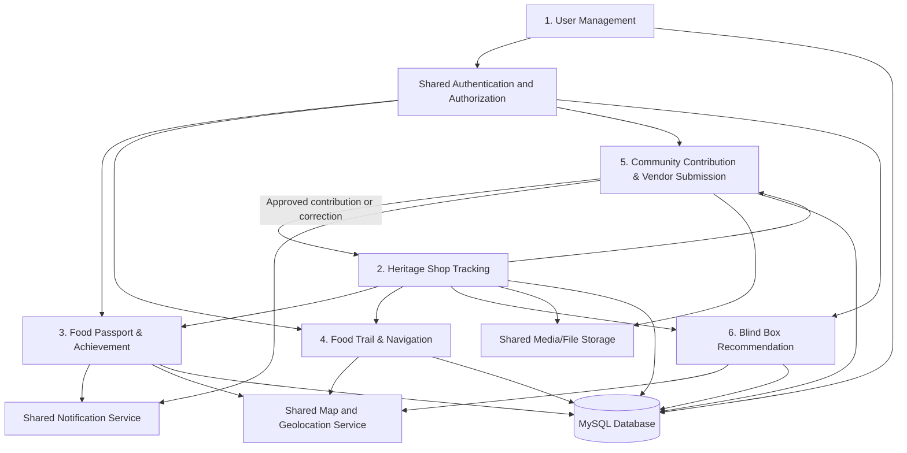

# WarisanMakan — Overall Module Structure and Development Scope

**Project:** Culinary Heritage Tourism System (WarisanMakan)  
**System type:** Web-Based Progressive Web Application (PWA)  
**Technology:** Laravel, PHP, Blade, JavaScript, MySQL  
**Recommended architecture:** Modular Monolith using Laravel MVC with a Service Layer  
**Primary actors:** User and System Administrator

---

# 1. Purpose of This Document

This document defines the overall structure of the WarisanMakan system and explains what each module is responsible for. It is intended to help the team:

- understand the boundary of every module;
- avoid implementing the same function in multiple modules;
- identify the data and services that must be shared;
- coordinate module integration;
- plan controllers, services, models, views, routes, tests, and database tables;
- determine when each module is considered complete.

WarisanMakan contains six main functional modules:

1. User Management
2. Heritage Shop Tracking
3. Food Passport & Achievement
4. Food Trail & Navigation
5. Community Contribution & Vendor Submission
6. Blind Box Recommendation

---

# 2. Overall System Objective

WarisanMakan is a digital platform that supports the preservation, promotion, and exploration of Malaysia's culinary heritage. It allows users to discover heritage food shops, learn their cultural and family histories, generate food trails, check in at participating locations, collect digital passport stamps and badges, contribute heritage information, and receive random heritage-shop recommendations.

The system also provides administrative functions for managing users, heritage shops, food items, badges, curated trails, community submissions, correction requests, and Blind Box recommendation records.

---

# 3. Main Actors and Access Levels

## 3.1 User

A User represents a registered person who accesses the public side of WarisanMakan. This includes tourists, local visitors, community contributors, and traditional food vendors.

A User may:

- continue with Google and access the system;
- manage their profile;
- browse and search heritage shops;
- view heritage food and shop information;
- check in at participating shops;
- collect passport stamps and achievement badges;
- view passport progress and leaderboard rankings;
- generate, save, follow, and share food trails;
- submit heritage shop information or heritage food stories;
- report incorrect or outdated shop information;
- generate and reveal Blind Box recommendations.

## 3.2 System Administrator

A System Administrator manages the system's controlled and verified content.

A System Administrator may:

- manage user account status;
- manage heritage shops and heritage food items;
- publish or unpublish heritage shops;
- manage achievement badges;
- create and manage curated food trails;
- review and moderate community submissions;
- review correction requests;
- manage Blind Box recommendation records and settings;
- view audit information and relevant statistics.

---

# 4. High-Level Module Map



The **Heritage Shop Tracking Module** is the main content source used by the Food Passport, Food Trail, Community Contribution, and Blind Box modules. The **User Management Module** provides authentication and account information used by every protected module.

---

# 5. Module Ownership and Team Responsibility

| No. | Module | Assigned Team Member | Main Responsibility |
|---|---|---|---|
| 1 | User Management | Soon Yen Ling | Authentication, user profiles, and account administration |
| 2 | Heritage Shop Tracking | Edmund Teh Wei Han | Heritage shop and food information management |
| 3 | Food Passport & Achievement | Chua Yee Teng | Check-ins, passport progress, badges, and leaderboard |
| 4 | Food Trail & Navigation | Tang Le Yi | Trail generation, maps, navigation, favourites, and curated trails |
| 5 | Community Contribution & Vendor Submission | Mok Chun Bing | User submissions, moderation, revision, correction requests, and audit history |
| 6 | Blind Box Recommendation | Chang Hui Yee | Random shop recommendations, reveal, re-roll, history, favourites, and recommendation administration |

Although each member owns one module, all members must coordinate shared database structures, authentication, routes, UI layout, notifications, media storage, testing, and integration.

---

# 6. Summary of Module Responsibilities

| Module | Primary Purpose | User-Side Scope | Administrator-Side Scope |
|---|---|---|---|
| User Management | Control access and user identity | Continue with Google, logout, view and update profile | View, search, deactivate, and reactivate accounts |
| Heritage Shop Tracking | Maintain the central heritage-shop database | Browse, search, filter, view shop profiles and food items | Create, update, delete, publish, and manage shops and food items |
| Food Passport & Achievement | Encourage physical heritage-food exploration | Check in, collect stamps, track progress, earn badges, view rankings, share achievements | Create, update, activate, deactivate, and audit badges |
| Food Trail & Navigation | Help users plan and follow food journeys | Generate trails, filter, map vendors, navigate, save, share, and track progress | Create, edit, delete, publish, and unpublish curated trails |
| Community Contribution & Vendor Submission | Collect and verify community heritage information | Submit content, save drafts, upload media, track status, revise, withdraw, and request corrections | Review, approve, reject, request revision, update records, and maintain audit history |
| Blind Box Recommendation | Provide an engaging random discovery feature | Apply filters, generate, reveal, re-roll, save, view history, and navigate | Manage the recommendation pool, tags, availability, settings, and statistics |

---

# 7. Detailed Module Structure

## 7.1 User Management Module

### 7.1.1 Module Purpose

The User Management Module controls authentication, user identity, session access, user profile information, roles, and account status. It is a foundational module because the protected functions in the other modules depend on a valid authenticated user.

### 7.1.2 User-Side Functions

#### A. Continue with Google

- Redirect the user to Google authentication.
- Verify the Google account.
- Check whether the user already exists.
- Automatically create a new account for a first-time user.
- Retrieve the existing account for a returning user.
- Create the authenticated session.
- Redirect the user to the correct dashboard or home page.

#### B. View Profile

- Retrieve the authenticated user's profile.
- Display name, email, profile image, and other supported profile fields.
- Ensure one user cannot access another user's private profile information.

#### C. Update Profile

- Display the current profile information.
- Allow permitted fields to be updated.
- Validate the submitted information.
- Save changes and display confirmation.

#### D. Logout

- Terminate the authenticated session securely.
- Clear the relevant session information.
- Redirect the user to the public home page or login page.

### 7.1.3 Administrator-Side Functions

#### A. View User Accounts

- Display all registered users.
- Show account role, registration details, and account status.
- Support pagination when the account list becomes large.

#### B. Search User Accounts

- Search by name or email.
- Display matching account records.
- Handle empty search results clearly.

#### C. Deactivate User Account

- Change an active account to deactivated status.
- Prevent a deactivated user from accessing protected functions.
- Preserve the user's existing contributions, check-ins, badges, and history.

#### D. Reactivate User Account

- Restore access to a previously deactivated account.
- Record who performed the administrative action where audit information is required.

### 7.1.4 Main Business Rules

- Google authentication is the main account-access method.
- Each Google account should be linked to only one WarisanMakan user account.
- Email and Google account identifiers must be unique.
- Only active accounts may use protected features.
- Only administrators may access account-management pages.
- Deactivation should not permanently delete historical records.

### 7.1.5 Main Data Owned

- User account
- Google account identifier
- User profile
- User role
- Account status
- Login/session information

### 7.1.6 Main Pages

**User pages:**

- Continue with Google page/button
- User profile page
- Update profile page

**Administrator pages:**

- User account list
- User account detail
- Search results
- Deactivate/reactivate confirmation

### 7.1.7 Module Dependencies

This module provides the following information to all other modules:

- authenticated user ID;
- user role;
- account status;
- profile information;
- authorization checks.

### 7.1.8 Definition of Done

The module is complete when:

- first-time and returning users can continue with Google;
- authenticated sessions are created and terminated correctly;
- users can view and update their own profiles;
- administrators can view and search user accounts;
- administrators can deactivate and reactivate accounts;
- authorization tests prevent users from accessing administrator routes;
- deactivated users cannot use protected functions.

---

## 7.2 Heritage Shop Tracking Module

### 7.2.1 Module Purpose

The Heritage Shop Tracking Module is the central heritage-content module. It stores and presents verified heritage shop information, family history, founder background, current-generation ownership, operating hours, locations, images, food categories, and heritage food items.

Other modules should reference this module instead of creating separate copies of heritage shop data.

### 7.2.2 User-Side Functions

#### A. View Heritage Shop List

- Display only published heritage shops.
- Use pagination or incremental loading.
- Display a summary for each shop, such as name, image, category, state, and short address.
- Provide a clear empty state when no shops are available.

#### B. Search Heritage Shops

- Search by shop name or keyword.
- Match suitable fields such as shop name, description, category, and address.
- Return only published records.
- Display a no-results message when no match exists.

#### C. Filter Heritage Shops

- Filter by food category.
- Filter by state.
- Filter by location where supported.
- Allow search and filtering to operate together.
- Allow users to clear individual filters or all filters.

#### D. View Heritage Shop Profile

Display the complete verified shop profile, including:

- shop name;
- description;
- establishment year;
- founder name and background;
- current-generation owner details;
- family heritage story;
- operating hours;
- address and location;
- images or other media;
- associated heritage food items;
- publish or participation information where relevant to other modules.

#### E. View Heritage Food Items

- Display food items associated with the selected shop.
- Display item name, description, image, category, heritage significance, and availability where included.
- Show an empty state when no active food item is available.

### 7.2.3 Administrator-Side Functions

#### A. Manage Heritage Shops

The administrator must be able to:

- create a shop record;
- view all shop records, including draft and unpublished records;
- update an existing record;
- delete or archive an inappropriate record;
- validate mandatory shop information;
- prevent accidental duplicate records where possible.

#### B. Publish or Unpublish Heritage Shop

- Check that required information is complete before publishing.
- Publish a shop to make it available to users.
- Unpublish a shop to remove it from public browsing, search, trails, check-ins, and recommendations where applicable.
- Record the status update.

#### C. Manage Heritage Food Items

The administrator must be able to:

- create a food item under a shop;
- update food item details;
- set availability status;
- upload or replace an image;
- delete or archive a food item.

### 7.2.4 Main Business Rules

- Users may view only published heritage shops.
- Administrator pages may display draft, published, and unpublished records.
- A shop should not be published when mandatory information is missing.
- A food item belongs to one heritage shop.
- Search and filters must not expose unpublished records.
- A shop used by check-ins, trails, contributions, or recommendation history should normally be archived or soft deleted instead of physically removed.
- Location coordinates must be valid before location-dependent functions use the shop.

### 7.2.5 Main Data Owned

- Heritage shop
- Heritage food item
- Food category
- Shop-category relationship
- Shop media
- Address and geographical coordinates
- Publish status
- Participation status

### 7.2.6 Main Pages

**User pages:**

- Heritage shop list
- Search and filter interface
- Heritage shop profile
- Heritage food item list/detail

**Administrator pages:**

- Heritage shop dashboard/list
- Create shop form
- Edit shop form
- Shop detail/preview
- Publish/unpublish confirmation
- Heritage food item management

### 7.2.7 Module Dependencies

This module provides heritage shop data to:

- Food Passport & Achievement for participating-shop check-ins;
- Food Trail & Navigation for route stops and map markers;
- Community Contribution for related-shop selection and approved updates;
- Blind Box Recommendation for eligible recommendation records.

It receives approved new information or corrections from the Community Contribution Module.

### 7.2.8 Definition of Done

The module is complete when:

- users can browse, search, filter, and view published shops;
- profile information and food items display correctly;
- administrators can perform shop and food-item CRUD operations;
- publishing and unpublishing control public visibility;
- invalid or incomplete records are rejected;
- other modules can reference the same shop records through stable IDs;
- feature tests cover public visibility, searching, filtering, and administrator authorization.

---

## 7.3 Food Passport & Achievement Module

### 7.3.1 Module Purpose

The Food Passport & Achievement Module encourages users to physically explore heritage food locations. It verifies location-based check-ins, records visits, awards passport stamps and points, calculates progress, unlocks achievement badges, and displays leaderboard rankings.

### 7.3.2 User-Side Functions

#### A. View Participating Heritage Shops

- Retrieve heritage shops that are published and marked as participating.
- Display their location and check-in availability.
- Link each shop to its verified profile.

#### B. Check In at a Heritage Shop

- Request the user's current location.
- Compare the user's coordinates with the selected shop's coordinates.
- Verify that the user is inside the permitted radius.
- Reject check-in when location permission is denied or coordinates are unavailable.
- Prevent duplicate check-ins according to the defined project rule.
- Record shop name, date, time, coordinates, passport stamp, and points after success.

#### C. Maintain Visit History

- Store every successful check-in.
- Allow the user to view, search, filter, and sort visited locations.
- Display check-in date and time.

#### D. Track Passport Progress

- Calculate the percentage of participating shops visited.
- Display collected passport stamps.
- Display remaining participating shops.
- Display total shops visited, total stamps, points, and badges.

#### E. Award Achievement Badges

- Evaluate badge criteria after a successful check-in.
- Automatically unlock eligible badges.
- Prevent the same badge from being awarded twice.
- Notify the user when a badge is unlocked.
- Preserve the original unlock date.

#### F. View Badge Collection

- Display locked and unlocked badges.
- Display badge name, description, icon, category, criteria, unlock status, and unlock date.

#### G. View Leaderboard

- Rank users using the approved ranking rule, such as passport points or number of shops visited.
- Display usernames and ranking positions.
- Highlight the authenticated user's position where suitable.

#### H. Share Achievement

- Allow users to share badges or passport milestones through supported sharing options.
- Handle cancellation, unsupported apps, and failed sharing attempts.

### 7.3.3 Administrator-Side Functions

#### A. Manage Achievement Badges

The administrator must be able to:

- create a badge;
- edit badge name, description, icon, category, and criteria;
- activate or deactivate a badge;
- validate badge information;
- preserve badges already awarded to users;
- archive or deactivate badges rather than deleting historical achievements.

#### B. View Badge Audit Information

- Record badge creation, update, activation, and deactivation.
- Store the administrator, action, old values, new values, and timestamp.

### 7.3.4 Main Business Rules

- The user must be authenticated to check in.
- The shop must be published and participating.
- The user's location must fall within the permitted check-in radius.
- Duplicate check-ins must be prevented according to the agreed definition.
- Failed check-ins must not create passport records.
- A badge may only be unlocked once per user.
- Editing or deactivating a badge must not remove it from users who already earned it.
- Leaderboard calculations must use one consistent ranking formula.

### 7.3.5 Main Data Owned

- Check-in
- Passport stamp and points
- Visit history
- Achievement badge
- User badge
- Badge audit log
- Calculated passport statistics

### 7.3.6 Main Pages

**User pages:**

- Participating shops
- Check-in screen
- Check-in result
- Digital Food Passport
- Visit history
- Badge collection
- Badge detail
- Passport statistics
- Leaderboard
- Share achievement

**Administrator pages:**

- Badge management list
- Create/edit badge form
- Activate/deactivate confirmation
- Badge audit history

### 7.3.7 Module Dependencies

- Requires authenticated user information from User Management.
- Requires published, participating shop data and coordinates from Heritage Shop Tracking.
- Uses the shared geolocation service.
- Uses the shared notification service for badge-unlocked notifications.

### 7.3.8 Definition of Done

The module is complete when:

- eligible users can check in successfully within the permitted radius;
- invalid and duplicate check-ins are rejected;
- visit history and passport progress update correctly;
- badge criteria are evaluated and badges are awarded once;
- passport statistics and leaderboard rankings are correct;
- administrators can manage badges without deleting historical achievements;
- location, badge, and authorization rules are covered by tests.

---

## 7.4 Food Trail & Navigation Module

### 7.4.1 Module Purpose

The Food Trail & Navigation Module helps users discover multiple heritage food shops in a planned journey. It generates trails based on location and category, presents shops on a map, provides route information, saves favourite trails, tracks completion, supports sharing, and presents administrator-curated trails.

### 7.4.2 User-Side Functions

#### A. Select Trail Location

- Allow the user to enter or select a location.
- Validate whether the location is supported.
- Retrieve matching heritage shops in the selected area.

#### B. Generate Heritage Food Trail

- Accept the selected location and food-category preference.
- Find eligible published shops.
- Arrange shops into a practical route.
- Display the generated trail on the map.
- Show trail information such as stops, distance, and estimated duration where supported.

#### C. Filter Trail

- Filter by food category.
- Apply filters before or during generation.
- Handle cases where no shop matches the selected criteria.

#### D. View Vendor on Map

- Display map markers for shops in the trail.
- Allow the user to select a marker.
- Display shop summary and link to the full shop profile.

#### E. Get Navigation Route

- Obtain the user's current location.
- Generate directions to the selected shop or next trail stop.
- Display estimated distance and travel time.
- Handle denied location permission, missing coordinates, unavailable services, and network errors.

#### F. Save Trail as Favourite

- Allow a generated or curated trail to be saved.
- Prevent duplicate favourite relationships.
- Display all saved favourite trails.
- Allow the user to remove a saved trail.

#### G. Track Trail Completion

- Record the user's trail progress.
- Show completed and remaining stops.
- Calculate completion percentage.
- Mark the trail completed when its completion criteria are satisfied.

#### H. Share Food Trail

- Allow users to share a trail by supported social platforms or link.
- Where the sharing form is included, allow title, description, visibility, and optional photos.
- Respect public/private visibility.

#### I. View Curated Food Trails

- Display published curated trails prepared by administrators.
- Show route, vendor stops, descriptions, ratings if supported, and recommended highlights.
- Allow the user to save, share, or navigate a curated trail.

### 7.4.3 Administrator-Side Functions

#### A. Create Curated Food Trail

- Enter trail name, description, location, category, recommended vendors, route details, and heritage highlights.
- Validate that selected shops exist and are suitable.
- Save the trail initially as draft where appropriate.

#### B. Edit Curated Food Trail

- Update trail information, stop order, vendor selection, route notes, and highlights.
- Preserve a valid route after changes.

#### C. Delete Curated Food Trail

- Remove or archive the curated trail.
- Warn the administrator when it has already been saved or used by users.

#### D. Publish or Unpublish Curated Trail

- Publish a complete trail so users can browse it.
- Unpublish it to hide it from public discovery.
- Display the current status in the administrator list.

#### E. View Curated Trail Status

- View all trails and their draft, published, unpublished, active, or unavailable status.

### 7.4.4 Main Business Rules

- Trail stops must reference existing heritage shops.
- Public trails should use published and available shops.
- A generated trail must contain at least one eligible shop.
- Stop order must be unique within a trail.
- Private shared trails must not appear in public discovery.
- Unpublished curated trails must not be visible to users.
- Invalid or missing coordinates must be handled before route generation.
- A saved favourite trail should not be duplicated for the same user.

### 7.4.5 Main Data Owned

- Food trail
- Trail type: generated or curated
- Trail stop
- Trail category
- Route details/polyline
- Favourite trail
- Trail progress
- Trail media
- Trail visibility and publish status

### 7.4.6 Main Pages

**User pages:**

- Trail-generation form
- Generated trail map
- Vendor marker detail
- Navigation view
- Favourite trails
- Trail progress
- Share trail form
- Curated trail list
- Curated trail detail

**Administrator pages:**

- Curated trail dashboard
- Create curated trail form
- Edit curated trail form
- Trail preview
- Publish/unpublish controls

### 7.4.7 Module Dependencies

- Requires authenticated user information from User Management.
- Requires published shop, category, location, and availability data from Heritage Shop Tracking.
- Uses the shared map, routing, and geolocation service.
- May use check-in information from Food Passport to support completion tracking, depending on the agreed implementation rule.

### 7.4.8 Definition of Done

The module is complete when:

- users can generate a trail using location and category;
- eligible shops display correctly on a map;
- route and vendor details are available;
- users can save, view, remove, and share favourite trails;
- progress can be tracked consistently;
- users can browse published curated trails;
- administrators can create, edit, delete, publish, and unpublish curated trails;
- location, visibility, and route-validation tests pass.

---

## 7.5 Community Contribution & Vendor Submission Module

### 7.5.1 Module Purpose

The Community Contribution & Vendor Submission Module allows registered users and vendors to contribute heritage information while ensuring that unverified information is not published immediately. It manages the complete workflow from draft creation to administrator moderation, revision, approval, rejection, withdrawal, correction, notification, and audit history.

### 7.5.2 Current Working Edit Rule

The project documents contain different wording about when a contribution can be edited. The recommended current working rule is:

- `DRAFT`: the user may edit or delete it;
- `PENDING_REVIEW`: the user may view it and withdraw it only before review begins;
- `UNDER_REVIEW`: the user may only view it;
- `REVISION_REQUIRED`: the user may edit and resubmit it;
- `APPROVED`, `REJECTED`, or `WITHDRAWN`: the record remains in history and is not directly editable.

This rule prevents the administrator from reviewing information that changes during the review process.

### 7.5.3 User-Side Functions

#### A. Submit Heritage Shop Information

The form may contain:

- contribution title;
- shop name;
- food category;
- establishment year;
- founder name and background;
- current owner details;
- family heritage story;
- operating hours;
- contact number;
- address, city, state, and postal code;
- coordinates where supported;
- supporting media.

The system must validate mandatory fields and associate the record with the authenticated contributor.

#### B. Submit Heritage Food Story

The form may contain:

- contribution title;
- related shop or food item;
- food name;
- story title;
- story content;
- cultural significance;
- supporting media.

Shop-information details and food-story details should be stored separately to keep the data structure clear.

#### C. Upload Supporting Media

- Upload images and supported videos.
- Validate file extension, MIME type, and size.
- Generate safe filenames.
- Preview uploaded files.
- Allow removal or replacement before submission.
- Prevent uploaded files from being executed.

#### D. Save and Manage Drafts

- Save an incomplete contribution as `DRAFT`.
- Display all personal drafts.
- Open and edit a draft.
- Add or remove media.
- Delete a draft.
- Submit a saved draft for review.

#### E. View Contribution History and Details

Display:

- contribution title and type;
- submission date;
- last updated date;
- current status;
- full submitted information;
- attached media;
- administrator feedback;
- available actions;
- version or edit history where supported.

#### F. Withdraw Pending Contribution

- Allow withdrawal only when the contribution is `PENDING_REVIEW`.
- Confirm that review has not started.
- Display a confirmation dialog.
- Recheck the rule on the server before changing status.
- Store the withdrawal time.
- Keep the record in contribution history.

#### G. Revise and Resubmit

- Display administrator revision instructions.
- Allow editing only when status is `REVISION_REQUIRED`.
- Store a new version of the contribution.
- Allow replacement or additional media.
- Change status back to `PENDING_REVIEW` after resubmission.

#### H. Submit Heritage Information Correction Request

From a published shop profile, allow the user to report incorrect or outdated information.

The request should include:

- related heritage shop;
- field believed to be incorrect;
- current displayed value;
- proposed corrected value;
- reason;
- supporting evidence.

The user must be able to view the request status and administrator comments and provide additional information when requested.

#### I. Receive Notifications

Notify the user when:

- a contribution is approved;
- a contribution is rejected;
- revision is required;
- a correction request is approved;
- a correction request is rejected;
- additional correction information is required.

### 7.5.4 Administrator-Side Functions

#### A. Submission Management Dashboard

- Display pending, under-review, revision-required, approved, and rejected counts.
- Separate heritage-shop and heritage-food-story submissions.
- Search by title or contributor.
- Filter by status, contributor, type, or date.
- Sort the results.

#### B. Start Review

When review begins:

- change status from `PENDING_REVIEW` to `UNDER_REVIEW`;
- record review-start time;
- record the administrator;
- prevent user withdrawal;
- display all details, media, versions, and previous feedback.

#### C. Approve Contribution

- Validate that required information exists.
- Change status to `APPROVED`.
- Record review action and time.
- Create or hand off the approved record to Heritage Shop Tracking.
- Link the resulting shop or story record where supported.
- notify the contributor.

#### D. Reject Contribution

- Require a rejection reason.
- Change status to `REJECTED`.
- Store the administrator's comments.
- Notify the contributor.

#### E. Request Revision

- Require clear revision instructions.
- Change status to `REVISION_REQUIRED`.
- Store the instructions.
- Allow the contributor to edit and resubmit.
- Notify the contributor.

#### F. Delete Inappropriate or Duplicate Submission

- Require a reason.
- Prefer soft deletion to preserve audit history.
- Record the moderation action.

#### G. Review Correction Request

The administrator must be able to:

- compare the current and proposed values;
- view the user's reason and evidence;
- approve the request and update the published shop;
- reject the request with a reason;
- request additional information;
- notify the requester;
- keep a record of the decision.

#### H. View Moderation History

Display:

- record ID;
- administrator;
- moderation action;
- previous status;
- new status;
- comment or reason;
- date and time;
- contribution version reviewed.

Audit records should not be editable through normal application functions.

### 7.5.5 Contribution Status Flow

```text
DRAFT
  └── Submit
       └── PENDING_REVIEW
            ├── User withdraws before review starts → WITHDRAWN
            └── Administrator starts review → UNDER_REVIEW
                    ├── Approve → APPROVED
                    ├── Reject → REJECTED
                    ├── Request revision → REVISION_REQUIRED
                    │       └── User revises and resubmits → PENDING_REVIEW
                    └── Delete inappropriate/duplicate → DELETED
```

### 7.5.6 Correction Request Status Flow

```text
PENDING
  └── UNDER_REVIEW
       ├── APPROVED
       ├── REJECTED
       └── ADDITIONAL_INFO_REQUIRED
              └── User provides information → PENDING or UNDER_REVIEW
```

### 7.5.7 Main Business Rules

- Only authenticated users may create contributions.
- A user may access only their own private drafts and submissions.
- A submitted record must not be changed while an administrator is reviewing it.
- Withdrawal is allowed only before review begins.
- Rejection and revision actions require administrator comments.
- Every moderation action must be audited.
- Approval and shop updates should use database transactions.
- Approved contribution data must not bypass Heritage Shop Tracking validation and ownership.
- Correction approval must update the intended published field safely.

### 7.5.8 Main Data Owned

- Contribution
- Contribution type details
- Contribution media
- Contribution version
- Contribution review
- Correction request
- Correction evidence
- Correction review
- Moderation audit data
- Related notifications

### 7.5.9 Main Pages

**User pages:**

- My Contributions dashboard
- Select contribution type
- Heritage Shop Submission form
- Heritage Food Story Submission form
- Draft list
- Draft detail/edit
- Contribution history
- Contribution detail
- Revision edit page
- Correction Request form
- My Correction Requests
- Correction Request detail
- Related notifications

**Administrator pages:**

- Community Submission dashboard
- Submission list with search and filters
- Submission review detail
- Contribution version history
- Correction Request list
- Correction Request review
- Moderation history/audit

### 7.5.10 Module Dependencies

- Requires authenticated user and administrator roles from User Management.
- Uses published shops, food items, and categories from Heritage Shop Tracking.
- Sends approved records or corrections to Heritage Shop Tracking.
- Uses the shared media service.
- Uses the shared notification service.

### 7.5.11 Definition of Done

The module is complete when:

- both contribution types can be created;
- drafts can be saved, edited, deleted, and submitted;
- media validation works;
- users can view status, history, details, and feedback;
- valid pending contributions can be withdrawn before review;
- revision-required records can be edited and resubmitted;
- correction requests can be submitted and tracked;
- administrators can search, review, and moderate submissions and corrections;
- every action is audited;
- correct notifications are generated;
- approved information is safely integrated with Heritage Shop Tracking;
- authorization and status-transition tests pass.

---

## 7.6 Blind Box Recommendation Module

### 7.6.1 Module Purpose

The Blind Box Recommendation Module provides a gamified heritage-food discovery experience. It randomly recommends one eligible heritage food shop based on user-selected filters, hides the result until reveal, supports re-rolling, stores recommendation history, and allows favourites and navigation.

### 7.6.2 User-Side Functions

#### A. Set Recommendation Filters

Allow users to filter by:

- state;
- food category;
- distance;
- halal or non-halal status.

The system must find only eligible, published, enabled shops that match the selected criteria.

#### B. Generate Random Recommendation

- Start a Blind Box session.
- Collect all eligible recommendations.
- Randomly select one shop.
- Ensure the selected record remains valid.
- Save the generated recommendation.

#### C. Hide and Reveal Recommendation

- Display a mystery Blind Box before reveal.
- Hide the shop name and details.
- Reveal the selected shop only after the user confirms.
- Display shop image, details, and a link to the full heritage shop profile.
- Prevent repeated reveal actions from creating duplicate records.

#### D. Re-Roll Recommendation

- Allow the user to generate another recommendation.
- Prevent the same shop from appearing consecutively in the same session when alternatives exist.
- Disable or explain re-roll when no alternative recommendation exists.
- Record the next roll number.

#### E. Save Recommendation History

- Automatically store each generated result.
- Record the session, selected filters, roll number, reveal status, and generated time.
- Allow users to view previous Blind Box results.

#### F. Manage Favourite Recommendations

- Save a recommended shop to favourites.
- Prevent duplicate favourite records.
- Remove a recommendation from favourites.
- Display saved recommendations.

#### G. View Recommended Shop Details

After reveal, display:

- shop name and image;
- state and address;
- categories;
- halal status where available;
- heritage summary;
- operating hours;
- link to the full shop profile.

#### H. Get Navigation Directions

- Allow the user to navigate to the recommended shop.
- Reuse the shared navigation and geolocation service.
- Handle missing shop coordinates or denied user location permission.

### 7.6.3 Administrator-Side Functions

#### A. View and Search Blind Box Records

- Display all recommendation-pool records.
- Search by shop, state, category, or tag.
- Display enabled or disabled status.

#### B. Add Shop to Recommendation Pool

- Select an existing heritage shop.
- Add recommendation tags and settings.
- Validate that the shop is suitable and not already duplicated in the pool.

#### C. Update Recommendation Information

- Update tags, state mapping, category mapping, or enabled status.
- Ensure the linked shop remains valid.

#### D. Enable or Disable Recommendation

- Disable a record without deleting its history.
- Ensure disabled records are excluded from new recommendations.
- Preserve existing user recommendation history.

#### E. Remove Recommendation Record

- Warn when the record is related to existing history.
- Prefer archive or soft deletion where historical references must remain.

#### F. Manage Recommendation Settings

- Manage available states.
- Manage food-category filters.
- Manage recommendation tags.
- Maintain filter values used by the recommendation engine.

#### G. View Recommendation Statistics

Display suitable statistics such as:

- recommendation frequency;
- most frequently recommended shops;
- popularity or favourite count;
- filter usage;
- reveal and re-roll counts where recorded.

### 7.6.4 Main Business Rules

- Only published and enabled shops may be newly recommended.
- The generated shop must satisfy all selected filters.
- Selection should be random among eligible records.
- The same shop should not appear consecutively during one session when alternatives exist.
- Shop details remain hidden until reveal.
- Every generated result is saved in history.
- Disabled pool records must remain in old history but must not be selected again.
- A recommendation favourite should not be duplicated for the same user.

### 7.6.5 Main Data Owned

- Blind Box recommendation pool
- Blind Box session
- Generated recommendation
- Roll number
- Reveal status
- Selected filters
- Recommendation tags
- Favourite recommendation
- Recommendation statistics

### 7.6.6 Main Pages

**User pages:**

- Blind Box filter page
- Mystery Blind Box/reveal page
- Recommendation result page
- Re-roll result
- Recommendation history
- Favourite recommendations
- Navigation action

**Administrator pages:**

- Blind Box management dashboard
- Recommendation pool list
- Add/edit recommendation record
- Enable/disable controls
- Recommendation settings
- Recommendation statistics

### 7.6.7 Module Dependencies

- Requires authenticated user information from User Management.
- Requires published shop, category, state, halal status, and coordinates from Heritage Shop Tracking.
- Uses the shared navigation and geolocation service.
- Must link to the official shop profile instead of copying full shop content into the recommendation table.

### 7.6.8 Definition of Done

The module is complete when:

- users can apply all approved filters;
- one eligible shop is selected randomly;
- the result remains hidden before reveal;
- re-roll avoids consecutive duplicates when alternatives exist;
- every recommendation is saved to history;
- favourites can be added and removed;
- navigation links to the recommended shop;
- administrators can manage the pool, settings, availability, and statistics;
- tests cover randomness constraints, filters, reveal, re-roll, and disabled records.

---

# 8. Shared Components Used Across Modules

The following are shared system components and should not be duplicated independently by every module.

## 8.1 Authentication and Authorization

Responsibilities:

- authenticated user session;
- Google authentication;
- user and administrator roles;
- active/deactivated account checks;
- route protection;
- policy or middleware authorization.

## 8.2 Notification Service

Possible notification types:

- badge unlocked;
- contribution approved;
- contribution rejected;
- revision requested;
- correction approved;
- correction rejected;
- additional correction information required.

Each notification should include:

- recipient user ID;
- notification type;
- reference ID;
- title/message;
- read/unread status;
- creation time;
- route to the related record.

## 8.3 Media and File Storage

Shared handling for:

- shop images;
- food-item images;
- contribution images and videos;
- correction evidence;
- trail photos;
- badge icons.

Shared requirements:

- MIME-type and file-extension validation;
- size limits;
- generated filenames;
- secure storage path;
- upload failure handling;
- cleanup of abandoned files;
- image optimization where appropriate.

## 8.4 Map, Location, and Navigation Service

Used by:

- Heritage Shop Tracking;
- Food Passport check-in;
- Food Trail generation and navigation;
- Blind Box navigation.

Shared responsibilities:

- shop coordinates;
- user location permission;
- location-distance calculation;
- map markers;
- route generation;
- estimated distance and time;
- service-error handling.

## 8.5 Search and Filtering

Search and filtering should follow consistent rules:

- validate search input;
- use pagination;
- prevent unpublished content from appearing;
- combine search and filters correctly;
- show empty states;
- preserve selected filters when navigating back where useful.

## 8.6 Audit Logging

Audit records are particularly important for:

- badge management;
- user-account status changes;
- shop publishing;
- community moderation;
- correction decisions;
- Blind Box pool administration.

Audit records should contain the administrator, action, related record, old value/status, new value/status, reason where relevant, and timestamp.

---

# 9. Cross-Module Integration Rules

## 9.1 User Management → All Protected Modules

Other modules must use the shared authenticated user and should not implement separate login systems.

## 9.2 Heritage Shop Tracking → Food Passport

Food Passport uses:

- shop ID;
- published status;
- participation status;
- shop coordinates;
- shop name and image.

## 9.3 Heritage Shop Tracking → Food Trail

Food Trail uses:

- published shops;
- food categories;
- state/location;
- coordinates;
- shop availability;
- profile links.

## 9.4 Heritage Shop Tracking → Blind Box

Blind Box uses:

- existing shop ID;
- published status;
- category;
- state;
- distance-related coordinates;
- halal status;
- profile information.

The Blind Box pool should not become a second heritage-shop database.

## 9.5 Community Contribution → Heritage Shop Tracking

When a contribution is approved:

- create a verified shop/story record or hand the approved data to the shop-management workflow;
- record the source contribution ID;
- avoid duplicate shop creation;
- perform the operation through a service and database transaction.

When a correction is approved:

- update only the approved field or information;
- preserve the old value in the review/audit record where possible;
- notify the requester after the shop update succeeds.

## 9.6 Food Passport ↔ Food Trail

Where the team decides that trail completion depends on physical visits, the trail module may read successful check-ins to mark stops completed. The ownership of check-in records must remain with Food Passport.

## 9.7 Shared Notifications

Modules should call one reusable notification service instead of creating different notification formats and tables.

---

# 10. Recommended Laravel Modular Structure

The project can remain one Laravel application while separating code by module. This is a **modular monolith**, not six separate systems.

```text
app/
├── Http/
│   ├── Controllers/
│   │   ├── UserManagement/
│   │   ├── HeritageShop/
│   │   ├── PassportAchievement/
│   │   ├── FoodTrail/
│   │   ├── CommunityContribution/
│   │   ├── BlindBox/
│   │   └── Admin/
│   ├── Middleware/
│   └── Requests/
│       ├── UserManagement/
│       ├── HeritageShop/
│       ├── PassportAchievement/
│       ├── FoodTrail/
│       ├── CommunityContribution/
│       └── BlindBox/
│
├── Models/
│   ├── User.php
│   ├── HeritageShop.php
│   ├── HeritageFoodItem.php
│   ├── CheckIn.php
│   ├── AchievementBadge.php
│   ├── FoodTrail.php
│   ├── Contribution.php
│   ├── CorrectionRequest.php
│   ├── BlindBoxSession.php
│   └── ...
│
├── Services/
│   ├── UserManagement/
│   ├── HeritageShop/
│   ├── PassportAchievement/
│   ├── FoodTrail/
│   ├── CommunityContribution/
│   ├── BlindBox/
│   └── Shared/
│       ├── NotificationService.php
│       ├── MediaService.php
│       ├── GeolocationService.php
│       └── AuditLogService.php
│
├── Policies/
└── Enums/

resources/
└── views/
    ├── layouts/
    ├── components/
    ├── user-management/
    ├── heritage-shops/
    ├── passport-achievement/
    ├── food-trails/
    ├── community-contribution/
    ├── blind-box/
    └── admin/

routes/
├── web.php
└── modules/
    ├── user-management.php
    ├── heritage-shops.php
    ├── passport-achievement.php
    ├── food-trails.php
    ├── community-contribution.php
    ├── blind-box.php
    └── admin.php

database/
├── migrations/
├── seeders/
└── factories/

tests/
├── Feature/
│   ├── UserManagement/
│   ├── HeritageShop/
│   ├── PassportAchievement/
│   ├── FoodTrail/
│   ├── CommunityContribution/
│   └── BlindBox/
└── Unit/
    └── Services/
```

The exact folder names may be adjusted, but every module should have a clear location for its controllers, requests, services, views, routes, and tests.

---

# 11. Recommended Request Flow

```text
User Browser / PWA
        ↓
Laravel Route
        ↓
Authentication and Role Middleware
        ↓
Form Request Validation
        ↓
Module Controller
        ↓
Module Service / Business Rules
        ↓
Eloquent Model and Database Transaction
        ↓
MySQL / File Storage / External Map Service
        ↓
Blade View or JSON Response
```

Controllers should coordinate the request and response. Complex rules such as check-in verification, contribution status changes, badge eligibility, trail generation, and Blind Box selection should be placed in services rather than directly inside controllers.

---

# 12. Suggested Core Database Ownership

| Module | Core Tables or Data Areas |
|---|---|
| User Management | `users`, sessions, account-status audit where used |
| Heritage Shop Tracking | `heritage_shops`, `heritage_food_items`, `food_categories`, `shop_categories`, `shop_media` |
| Food Passport & Achievement | `check_ins`, `achievement_badges`, `user_badges`, `badge_audit_logs` |
| Food Trail & Navigation | `food_trails`, `food_trail_stops`, `trail_categories`, `favourite_trails`, `trail_progress`, `trail_media` |
| Community Contribution | `contributions`, contribution detail tables, `contribution_media`, `contribution_versions`, `contribution_reviews`, `correction_requests`, evidence, correction reviews |
| Blind Box Recommendation | `blind_box_pool`, `blind_box_sessions`, `blind_box_recommendations`, `favourite_recommendations` |
| Shared | `notifications`, shared audit information where applicable |

Foreign keys should connect modules using stable IDs. Avoid copying complete user or shop information into several tables unless a historical snapshot is intentionally required.

---

# 13. Common Security and Validation Requirements

Every module must follow these rules:

- use server-side validation even when browser validation exists;
- use Laravel CSRF protection;
- use route middleware and policies for authorization;
- never trust user-supplied record IDs without ownership or role checks;
- use Eloquent or parameterized queries;
- validate uploaded MIME types, extensions, and sizes;
- sanitize displayed user-generated content;
- prevent mass-assignment vulnerabilities;
- use database transactions for multi-record operations;
- use soft deletion where historical references must remain;
- do not expose private draft, moderation, or administrator information;
- log important administrator actions;
- return clear but non-sensitive error messages.

---

# 14. Common User Interface Structure

## 14.1 Public/User Navigation

Suggested navigation:

- Home
- Heritage Shops
- Food Passport
- Food Trails
- Blind Box
- Contribute
- Notifications
- Profile

## 14.2 Administrator Navigation

Suggested navigation:

- Dashboard
- User Accounts
- Heritage Shops
- Heritage Food Items
- Achievement Badges
- Curated Food Trails
- Community Submissions
- Correction Requests
- Blind Box Management
- Audit/History

## 14.3 Shared UI Components

- application header and footer;
- responsive navigation;
- search bar;
- filter panel;
- pagination;
- form fields and validation messages;
- media uploader;
- status badge;
- confirmation modal;
- notification item;
- empty state;
- loading indicator;
- error and success alert;
- shop card;
- map marker/detail card.

---

# 15. Recommended Integration Order

The modules should not be integrated randomly. A practical order is:

1. **User Management** — establish authentication, roles, and account status.
2. **Heritage Shop Tracking** — establish the central shop, category, food, media, and location data.
3. **Food Passport & Achievement** — integrate authenticated users with participating shops and coordinates.
4. **Food Trail & Navigation** — reuse published shops, categories, and map data.
5. **Community Contribution** — approve or correct information into the central shop data.
6. **Blind Box Recommendation** — select from the verified shop database and reuse navigation.
7. **Shared notification and audit integration**.
8. **Full integration testing and UI consistency review**.

Some modules may be developed in parallel, but the database contracts and service interfaces should be agreed first.

---

# 16. Minimum Testing Scope by Module

| Module | Essential Tests |
|---|---|
| User Management | Google account creation/login, logout, profile update, admin authorization, deactivate/reactivate |
| Heritage Shop Tracking | Public visibility, pagination, search, filters, profile display, food items, CRUD, publish/unpublish |
| Food Passport & Achievement | valid/invalid radius, denied GPS, duplicate check-in, passport update, badge unlock once, ranking |
| Food Trail & Navigation | valid/invalid location, no matching shops, route generation, favourite duplication, visibility, curated trail CRUD |
| Community Contribution | draft CRUD, media validation, ownership, withdrawal timing, moderation, revision, correction, notification, audit |
| Blind Box Recommendation | filter matching, no eligible results, hidden reveal, random selection, no consecutive duplicate, re-roll, history, favourites, disabled pool record |

The final prototype should also include integration tests covering the interaction between modules.

---

# 17. Project-Wide Definition of Done

WarisanMakan is ready for final demonstration when:

- all six modules can run inside one integrated Laravel application;
- user and administrator access is protected correctly;
- each module uses the agreed shared database records;
- published heritage shops appear consistently in discovery features;
- unpublished or disabled records do not appear to users;
- location-dependent functions handle permission and service failures;
- community moderation updates the official heritage data safely;
- notifications and audit records are generated where required;
- responsive pages work on mobile, tablet, and desktop widths;
- key performance and usability targets are tested;
- feature and integration tests pass;
- seed data is available for a complete demonstration;
- no module depends on manually edited database records to work;
- the team can demonstrate one complete end-to-end user journey and one administrator journey.

---

# 18. Recommended End-to-End Demonstration Scenarios

## 18.1 User Journey

```text
Continue with Google
→ Browse/search heritage shops
→ View a shop profile and heritage food
→ Generate a food trail or Blind Box recommendation
→ Navigate to a participating shop
→ Perform a valid check-in
→ Receive a passport stamp and badge
→ View updated passport progress
→ Submit a heritage contribution or correction request
→ Receive a moderation notification
```

## 18.2 Administrator Journey

```text
Log in as administrator
→ Manage or publish a heritage shop
→ Create an achievement badge
→ Create and publish a curated food trail
→ Add the shop to the Blind Box pool
→ Review a community submission
→ Approve, reject, or request revision
→ View the moderation/audit history
→ Deactivate or reactivate a user account
```

---

# 19. Scope Consistency Notes

The following should be confirmed by the team before final coding:

1. **Community contribution editing:** use the current working rule in Section 7.5.2 unless the team officially changes it.
2. **Duplicate check-in definition:** confirm whether it means once per shop permanently, once per day, or another rule.
3. **Trail completion:** confirm whether completion is based on check-ins, manual stop completion, or both.
4. **Blind Box distance filter:** confirm whether distance is calculated from current location or a selected location.
5. **Heritage food item price:** some design material includes price, while the functional requirement mainly emphasizes name and description. Treat price as optional unless confirmed.
6. **Auto translation/language preferences:** these appeared in the proposal but are not part of the latest core functional-requirement list. Implement them only after the team confirms they remain in scope.
7. **Deletion policy:** use soft deletion or archiving for records referenced by history, badges, trails, contributions, or recommendations.

---

# 20. Source Basis

This document was prepared from the following project materials:

- `collaborative assignment.pdf`
- `Proposal.docx.pdf`
- `Requirement Analysis.pdf`
- the latest Community Contribution scope and workflow decisions
- the agreed Laravel modular-monolith and MVC development direction

